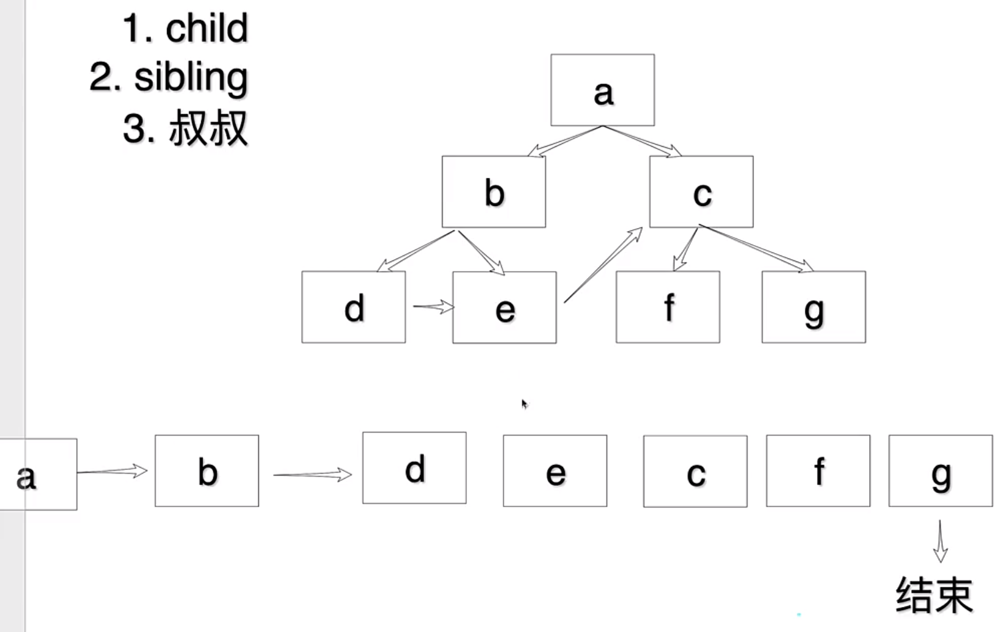

## 实现最简单的 mini-react

react API 的引用

```
import ReactDOM from "react-dom/client";
import App from "./App.jsx";

ReactDOM.createRoot(document.getElementById("root")).render(<App />);
```

### 写死渲染 dom

#### 第一步 创建 dom 元素

createElement 创建 dom 元素

```
const dom = document.createElement("div");
dom.id="app"
document.querySelector("#root").appendChild(dom);

const textNode = document.createTextNode("");
textNode.nodeValue = "app";
dom.append(textNode)

```

#### 第二步 创建虚拟 dom

react 是一个虚拟 dom 虚拟 dom 就是 js 对象

```
const element = {
    type: "div",
    props: {
        id: "app",
        children: [
            type:"TEXT_ELEMENT",
            props:{
                nodeValue:"app",
                children:[]
            }
        ]
    }
}
```

优化一下 把 TEXT_ELEMENT 虚拟 dom 抽离一下

```
const textElement = {
    type: "TEXT_ELEMENT",
    props: {
        nodeValue: "app",
        children: []
    }
}
const element = {
    type: "div",
    props: {
        id: "app",
        children: [textElement]
    }
}
```

接下来就是渲染虚拟 dom
我们把第一步的创建修改一下 可以看到页面上依然是可以展示 app 的

```
const dom = document.createElement(element.type);
dom.id=elment.props.id;
document.querySelector("#root").appendChild(dom);

const textNode = document.createTextNode("");
textNode.nodeValue = textElement.props.nodeValue;
dom.append(textNode)
```

### 动态创建 vnode

对于 textElement 虚拟 dom 来说 他的变动点就是 nodeValue
我们可以抽个函数出来 专门用来处理这个变动点

```
createTextNode(text){
    return {
        type: "TEXT_ELEMENT",
        props: {
            nodeValue: text,
            children: []
        }
    }
}
```

接下来就是 element 虚拟 dom 的变动点了, 他的变动点就是 type、props、children
通过剩余参数的写法 把 children 变成数组

```
function createElement(type,props,...children){
    return {
        type,
        props:{
            ...props,
            children
        }
    }
}
```

接下来调用一下 createElement 创建一个 App
我们就可以动态的创建虚拟 dom 了

```
const textElement=createTextNode("app");
const App = createElement("div",{id:"app"},textElement)

const dom = document.createElement(App.type);
dom.id=App.props.id;
document.querySelector("#root").appendChild(dom);

const textNode = document.createTextNode("");
textNode.nodeValue = textElement.props.nodeValue;
dom.append(textNode)
```

### 动态创建 dom （动态递归生成）

我们可以先观察一下创建 dom 节点的过程
第一步 ：创建一个节点
第二步 ：设置节点的属性也就是创建 props
第三步 ：把子节点添加到父节点中

我们可以把创建节点的过程抽成一个 render 函数

```
function render(el,container){
    // 创建节点 先判断一下是text类型么
    const dom = el.type === "TEXT_ELEMENT" ? document.createTextNode("") : document.createElement(el.type);
    // 设置节点属性 id class 等
    Object.keys(el.props).forEach((key)=>{
        // 判断一下是不是children属性 不是则直接赋值
        if(key !== "children"){
            dom[key]=el.props[key]
        }
    });
    // 把子节点添加到父节点中
    el.props.children.forEach((child)=>{
        render(child,dom)
    });
    // 添加到容器中
   container.append(dom);
}

const textElement=createTextNode("app");
const App = createElement("div",{id:"app"},textElement);
// 接下来我们就可以调用 render 函数把 App 渲染到页面上
render(App,document.querySelector("#root"));
```

### 重构 api

```
const textElement=createTextNode("app");
const App = createElement("div",{id:"app"},textElement);
```

不想通过 textElement=createTextNode("app") 来创建 app 节点，想要直接传入"app"

```
const App = createElement("div",{id:"app"},"app");
```

重构 createElement

```
function createElement(type,props,...children){
   return {
       type,
       props:{
           ...props,
           children:children.map((child)=>{
               return typeof child === "object" ? child : createTextNode(child);
           })
       }
   }
}
```

#### 实现 ReactDOM.createRoot

```
const ReactDOM = {
    createRoot(container){
        return {
            render(App){
                render(App,container);
            }
        }
    }
}

// 调用
const App = createElement("div",{id:"app"},"app");
ReactDOM.createRoot(document.querySelector("#root")).render(App);
```

为了更接近 react 的 api 我们拆分一下 分成两个 js
React.js

```

function createElement(type,props,...children){
    return {
        type,
        props:{
            ...props,
            children:children.map((child)=>{
                return typeof child === "object" ? child : createTextNode(child);
            })
        }
    }
}

function createTextNode(text){
    return {
        type: "TEXT_ELEMENT",
        props: {
            nodeValue: text,
            children: []
        }
    }
}

function render(el,container){
    // 创建节点 先判断一下是text类型么
    const dom = el.type === "TEXT_ELEMENT" ? document.createTextNode("") : document.createElement(el.type);
    // 设置节点属性 id class 等
    Object.keys(el.props).forEach((key)=>{
        // 判断一下是不是children属性 不是则直接赋值
        if(key !== "children"){
            dom[key]=el.props[key]
        }
    });
    // 把子节点添加到父节点中
    el.props.children.forEach((child)=>{
        render(child,dom)
    });
    // 添加到容器中
   container.append(dom);
}

const React = {
    createElement,
    render
}

export default React;
```

ReactDOM.js

```
import React from "./React.js";
const ReactDOM = {
    createRoot(container){
        return {
            render(App){
                React.render(App,container);
            }
        }
    }
}
export default ReactDOM;
```

App.js

```
import React from "./core/React.js";
const App = React.createElement("div",{id:"app"},"app");

export default App;
```

main.js

```
import ReactDOM from "./core/ReactDOM.js";
import App from "./App.js";

ReactDOM.createRoot(document.querySelector("#root")).render(App);
```

### 使用 jsx 代替掉 js 写法

#### 借助 vite 实现 jsx 的解析

创建一个 vite 项目 选择最普通的 Vanilla + js

```
pnpm create vite
```

把无用的代码先删除，然后把之前写好的 main.js 中的代码复制过来
再把 App.js 改成 App.jsx 复制过来
再把 core 文件夹 复制过来
index.html 文件中的是 app 我们修改成 root 页面就可以正常访问了
没用安装任何的依赖 就可以直接使用 jsx 了

很神奇 竟然两种写法都是调用 React.createElement 创建 App

```
import React from "./core/React.js";
// const App = React.createElement("div",{id:"app"},"app-hhh");
const App = <div>app-hhh</div>

export default App;
```

## 实现任务调度器

### 为什么我们需要调度器？

卡顿演示 demo:

```
const el=document.createElement("div");
el.innerText="1";
document.body.appendChild(el);
let i=0;
while(i<100000000){  // 模拟大量任务
    i++;
}
```

js 是单线程，如果我们在主线程中执行大量任务，会导致主线程阻塞，从而导致卡顿。

react 的 render 函数也是同样的道理，如果我们在 render 函数中执行大量任务(dom 树过大的时候)，也会导致卡顿，所以我们需要对任务进行拆分，拆分成一个个小任务，然后依次执行，从而避免卡顿。

因为 React 是一个异步的框架，它需要一个任务调度器来控制任务的执行顺序和优先级。

#### 思考：vue 会出现卡顿吗？

vue 中的任务调度器是基于微任务实现的，nextTick 它使用 Promise 来创建微任务，并将任务添加到微任务队列中。

React 中的任务调度器是基于宏任务实现的，它使用 setTimeout 来创建宏任务，并将任务添加到宏任务队列中。

vue 中的任务调度器是 Vue.js 中的一个核心概念，它负责协调和调度 Vue 组件的更新、渲染和交互等。React 中的任务调度器是 ReactFiber 中的一个核心概念，它负责协调和调度 React 组件的更新、渲染和交互等。

#### 拆分成一个个小任务，然后依次执行，从而避免卡顿

我们可以利用分支的思想，把一个大任务拆分成一个个小任务，然后依次执行这些小任务，从而避免卡顿。

比如每个分支只渲染两个 dom ，这样我们就不会有过多的逻辑去执行，就不会堵塞后续的渲染了。

我们可以先借助浏览器提供的 requestIdleCallback 方法，来模拟任务的拆分和执行。

timeRemaining 方法返回当前帧还剩余多少时间，单位是毫秒。

官网文档：develper.mozilla.org/zh-CN/docs/Web/API/Window/requestIdleCallback

requestIdleCallback demo 演示：

```
let taskId=1；
function workLoop(deadLine){
    taskId++;
    let shouldYield=false;// 判断是否中断
    while(!shouldYield){
        // run task
        console.log("taskId:",taskId);
        // dom
        shouldYield=deadLine.timeRemaining()<1;
    }
    requestIdleCallback(workLoop);
}

requestIdleCallback(workLoop);
```

转换到 react 中的实现：

React.js
```
let nextUnitOfWork=null;
function workLoop(deadLine){
    let shouldYield=false;// 判断是否中断
    while(nextUnitOfWork && !shouldYield){
        // 执行任务并返回下一个任务
        nextUnitOfWork=performWorkOfUnit(nextUnitOfWork);
        shouldYield=deadLine.timeRemaining()<1;// 剩余时间
    }
    if(nextUnitOfWork){
        requestIdleCallback(workLoop);
    }
}
// 任务调度器
requestIdleCallback(workLoop);
```

### 实现 filber 架构

问题：如何做到每次之渲染几个节点尼？下次执行的时候依然从之前的位置执行？

思路：把树结构转变成链表结构

如何把树转变成链表结构？

1.child(子节点) 先看当前节点有没有 child，如果有 child，那么 child 就是下一个节点

2.sibling(兄弟节点) 如果当前节点没有 child，那么就找当前节点的 sibling，如果当前节点没有 sibling，那么就找当前节点的 parent 的 sibling

3.parent 如果当前节点没有 sibling，那么就找当前节点的 parent，如果当前节点没有 parent，那么就结束


#### 实现转换链表

1.创建一个 performWorkOfUnit 函数，该函数接收一个节点作为参数，并转换链表 设置好指针 2.在 performWorkOfUnit 函数中，返回下一个要执行的任务

React.js

```
// 转换链表
function performWorkOfUnit(work){
    // render的时候已经给了dom  所以判断如果没有dom的时候再创建dom
    if(!work.dom){
        // 1. 创建 dom
        const dom = (work.dom = work.type === "TEXT_ELEMENT" ? document.createTextNode("") : document.createElement(work.type));

        // 父级容器
        work.parent.dom.append(dom);

        // 2. 处理 props
        Object.keys(work.props).forEach((key)=>{
            // 判断一下是不是children属性 不是则直接赋值
            if(key !== "children"){
                dom[key]=work.props[key]
            }
        });
    }
    // 3. 转换链表 设置好指针
    const children = work.props.children || [];
    let prevchild = null;// 上一个孩子节点
    children.forEach((child,index)=>{
        const newWork={// 为了不破坏 vnode (child) 所以新写一个
            type:child.type,
            props:child.props,
            parent:work,
            sibling:null,
            dom:null,
        }
        if(index===0){ // 如果是第一个 就直接放到child 中
            work.child=newWork;
        }else{
            prevchild.sibling=newWork; // 这样就 指向了 C
        }
        prevchild=newWork;
    });

    // 4. 返回下一个要执行的任务
    if(work.child){ // 有孩子节点 返回第一个孩子节点
        return work.child;
    }
    if(work.sibling){ // 没有孩子节点 返回兄弟节点
        return work.sibling;
    }
    return work.parent?.sibling || null;// 没有兄弟节点 返回父节点的兄弟节点
}
```

修改一下 render 函数
React.js

```
function render(el,container){
    // 创建一个根节点 作为任务执行的dom
    nextUnitOfWork={
        dom:container,
        props:{
            children:[el]
        }
    }
}
```

#### 重构代码

创建一个 createDom 函数来创建 dom

再创建一个 updateProps 函数来处理 props

再创建一个 initChildren 函数来处理子节点

并在 performWorkOfUnit 中使用

React.js

```
function createDom(type){
    return type === "TEXT_ELEMENT" ? document.createTextNode("") : document.createElement(type);
}

function updateProps(dom,props){
    Object.keys(props).forEach((key)=>{
        // 判断一下是不是children属性 不是则直接赋值
        if(key !== "children"){
            dom[key]=props[key]
        }
    });
}

function initChildren(fiber){
    // 3. 转换链表 设置好指针
    const children = fiber.props.children || [];
    let prevchild = null;// 上一个孩子节点
    children.forEach((child,index)=>{
        const newFiber={// 为了不破坏 vnode (child) 所以新写一个
            type:child.type,
            props:child.props,
            parent:fiber,
            sibling:null,
            dom:null,
        }
        if(index===0){ // 如果是第一个 就直接放到child 中
            fiber.child=newFiber;
        }else{
            prevchild.sibling=newFiber; // 这样就 指向了 C
        }
        prevchild=newFiber;
    });
}

function performWorkOfUnit(fiber){
    // render的时候已经给了dom  所以判断如果没有dom的时候再创建dom
    if(!fiber.dom){
        // 1. 创建 dom
        const dom = (fiber.dom = createDom(fiber.type));
        // 父级容器
        fiber.parent.dom.append(dom);
        // 2. 处理 props
        updateProps(dom,fiber.props);
    }

    // 3. 转换链表 设置好指针
    initChildren(fiber);

    // 4. 返回下一个要执行的任务
    if(fiber.child){ // 有孩子节点 返回第一个孩子节点
        return fiber.child;
    }
    if(fiber.sibling){ // 没有孩子节点 返回兄弟节点
        return fiber.sibling;
    }
    return fiber.parent?.sibling;// 没有兄弟节点 返回父节点的兄弟节点
}
```
