## 实现最简单的 mini-react

react API 的引用

```
import ReactDOM from "react-dom/client";
import App from "./App.jsx";

ReactDOM.createRoot(document.getElementById("root")).render(<App />);
```

### 写死渲染 dom

#### 第一步 创建 dom 元素

createElement 创建 dom 元素

```
const dom = document.createElement("div");
dom.id="app"
document.querySelector("#root").appendChild(dom);

const textNode = document.createTextNode("");
textNode.nodeValue = "hi-mini-react";
dom.append(textNode)

```

#### 第二步 创建虚拟 dom

react 是一个虚拟 dom 虚拟 dom 就是 js 对象

```
const element = {
    type: "div",
    props: {
        id: "app",
        children: [
            type:"TEXT_ELEMENT",
            props:{
                nodeValue:"app",
                children:[]
            }
        ]
    }
}
```

优化一下 把 TEXT_ELEMENT 虚拟 dom 抽离一下

```
const textElement = {
    type: "TEXT_ELEMENT",
    props: {
        nodeValue: "app",
        children: []
    }
}
const element = {
    type: "div",
    props: {
        id: "app",
        children: [textElement]
    }
}
```

接下来就是渲染虚拟 dom
我们把第一步的创建修改一下 可以看到页面上依然是可以展示 app 的

```
const dom = document.createElement(element.type);
dom.id=elment.props.id;
document.querySelector("#root").appendChild(dom);

const textNode = document.createTextNode("");
textNode.nodeValue = textElement.props.nodeValue;
dom.append(textNode)
```

### 动态创建 vnode

对于 textElement 虚拟 dom 来说 他的变动点就是 nodeValue
我们可以抽个函数出来 专门用来处理这个变动点

```
createTextNode(text){
    return {
        type: "TEXT_ELEMENT",
        props: {
            nodeValue: text,
            children: []
        }
    }
}
```

接下来就是 element 虚拟 dom 的变动点了, 他的变动点就是 type、props、children
通过剩余参数的写法 把 children 变成数组

```
function createElement(type,props,...children){
    return {
        type,
        props:{
            ...props,
            children
        }
    }
}
```

接下来调用一下 createElement 创建一个 App
我们就可以动态的创建虚拟 dom 了

```
const textElement=createTextNode("app");
const App = createElement("div",{id:"app"},textElement)

const dom = document.createElement(App.type);
dom.id=App.props.id;
document.querySelector("#root").appendChild(dom);

const textNode = document.createTextNode("");
textNode.nodeValue = textElement.props.nodeValue;
dom.append(textNode)
```

### 动态创建 dom （动态递归生成）

我们可以先观察一下创建 dom 节点的过程
第一步 ：创建一个节点
第二步 ：设置节点的属性也就是创建 props
第三步 ：把子节点添加到父节点中

我们可以把创建节点的过程抽成一个 render 函数

```
function render(el,container){
    // 创建节点 先判断一下是text类型么
    const dom = el.type === "TEXT_ELEMENT" ? document.createTextNode("") : document.createElement(el.type);
    // 设置节点属性 id class 等
    Object.keys(el.props).forEach((key)=>{
        // 判断一下是不是children属性 不是则直接赋值
        if(key !== "children"){
            dom[key]=el.props[key]
        }
    });
    // 把子节点添加到父节点中
    el.props.children.forEach((child)=>{
        render(child,dom)
    });
    // 添加到容器中
   container.append(dom);
}

const textElement=createTextNode("app");
const App = createElement("div",{id:"app"},textElement);
// 接下来我们就可以调用 render 函数把 App 渲染到页面上
render(App,document.querySelector("#root"));
```

### 重构 api

```
const textElement=createTextNode("app");
const App = createElement("div",{id:"app"},textElement);
```

不想通过 textElement=createTextNode("app") 来创建 app 节点，想要直接传入"app"

```
const App = createElement("div",{id:"app"},"app");
```

重构 createElement

```
function createElement(type,props,...children){
   return {
       type,
       props:{
           ...props,
           children:children.map((child)=>{
               return typeof child === "object" ? child : createTextNode(child);
           })
       }
   }
}
```

#### 实现 ReactDOM.createRoot

```
const ReactDOM = {
    createRoot(container){
        return {
            render(App){
                render(App,container);
            }
        }
    }
}

// 调用
const App = createElement("div",{id:"app"},"app");
ReactDOM.createRoot(document.querySelector("#root")).render(App);
```

为了更接近 react 的 api 我们拆分一下 分成两个 js
React.js

```

function createElement(type,props,...children){
    return {
        type,
        props:{
            ...props,
            children:children.map((child)=>{
                return typeof child === "object" ? child : createTextNode(child);
            })
        }
    }
}

function createTextNode(text){
    return {
        type: "TEXT_ELEMENT",
        props: {
            nodeValue: text,
            children: []
        }
    }
}

function render(el,container){
    // 创建节点 先判断一下是text类型么
    const dom = el.type === "TEXT_ELEMENT" ? document.createTextNode("") : document.createElement(el.type);
    // 设置节点属性 id class 等
    Object.keys(el.props).forEach((key)=>{
        // 判断一下是不是children属性 不是则直接赋值
        if(key !== "children"){
            dom[key]=el.props[key]
        }
    });
    // 把子节点添加到父节点中
    el.props.children.forEach((child)=>{
        render(child,dom)
    });
    // 添加到容器中
   container.append(dom);
}

const React = {
    createElement,
    render
}

export default React;
```

ReactDOM.js

```
import React from "./React.js";
const ReactDOM = {
    createRoot(container){
        return {
            render(App){
                React.render(App,container);
            }
        }
    }
}
export default ReactDOM;
```

App.js

```
import React from "./core/React.js";
const App = React.createElement("div",{id:"app"},"app");

export default App;
```

main.js

```
import ReactDOM from "./core/ReactDOM.js";
import App from "./App.js";

ReactDOM.createRoot(document.querySelector("#root")).render(App);
```

### 使用 jsx 代替掉 js 写法

#### 借助 vite 实现 jsx 的解析

创建一个 vite 项目 选择最普通的 Vanilla + js

```
pnpm create vite
```

把无用的代码先删除，然后把之前写好的 main.js 中的代码复制过来
再把 App.js 改成 App.jsx 复制过来
再把 core 文件夹 复制过来
index.html 文件中的是 app 我们修改成 root 页面就可以正常访问了
没用安装任何的依赖 就可以直接使用 jsx 了

很神奇 竟然两种写法都是调用 React.createElement 创建 App

```
import React from "./core/React.js";
// const App = React.createElement("div",{id:"app"},"app-hhh");
const App = <div>app-hhh</div>

export default App;
```

## 实现任务调度器

### 为什么我们需要调度器？

卡顿演示 demo:

```
const el=document.createElement("div");
el.innerText="1";
document.body.appendChild(el);
let i=0;
while(i<100000000){  // 模拟大量任务
    i++;
}
```

js 是单线程，如果我们在主线程中执行大量任务，会导致主线程阻塞，从而导致卡顿。

react 的 render 函数也是同样的道理，如果我们在 render 函数中执行大量任务(dom 树过大的时候)，也会导致卡顿，所以我们需要对任务进行拆分，拆分成一个个小任务，然后依次执行，从而避免卡顿。

因为 React 是一个异步的框架，它需要一个任务调度器来控制任务的执行顺序和优先级。

#### 思考：vue 会出现卡顿吗？

vue 中的任务调度器是基于微任务实现的，nextTick 它使用 Promise 来创建微任务，并将任务添加到微任务队列中。

React 中的任务调度器是基于宏任务实现的，它使用 setTimeout 来创建宏任务，并将任务添加到宏任务队列中。

vue 中的任务调度器是 Vue.js 中的一个核心概念，它负责协调和调度 Vue 组件的更新、渲染和交互等。React 中的任务调度器是 ReactFiber 中的一个核心概念，它负责协调和调度 React 组件的更新、渲染和交互等。

#### 拆分成一个个小任务，然后依次执行，从而避免卡顿

我们可以利用分支的思想，把一个大任务拆分成一个个小任务，然后依次执行这些小任务，从而避免卡顿。

比如每个分支只渲染两个 dom ，这样我们就不会有过多的逻辑去执行，就不会堵塞后续的渲染了。

我们可以先借助浏览器提供的 requestIdleCallback 方法，来模拟任务的拆分和执行。

timeRemaining 方法返回当前帧还剩余多少时间，单位是毫秒。

官网文档：develper.mozilla.org/zh-CN/docs/Web/API/Window/requestIdleCallback
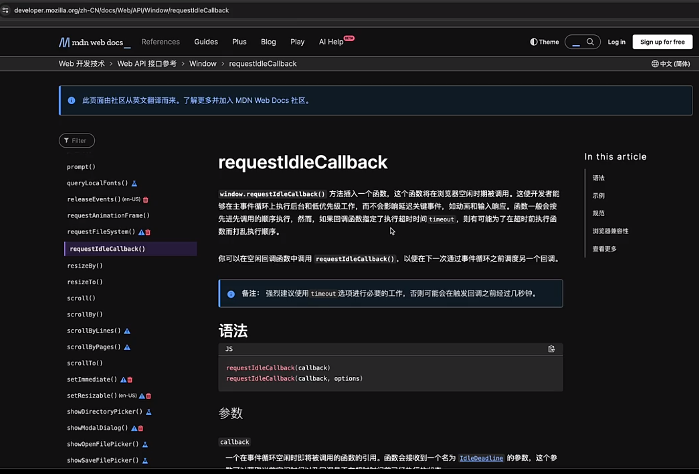
requestIdleCallback demo 演示：

```
let taskId=1；
function workLoop(deadLine){
    taskId++;
    let shouldYield=false;// 判断是否中断
    while(!shouldYield){
        // run task
        console.log("taskId:",taskId);
        // dom
        shouldYield=deadLine.timeRemaining()<1;
    }
    requestIdleCallback(workLoop);
}

requestIdleCallback(workLoop);
```

转换到 react 中的实现：

React.js

```
let nextUnitOfWork=null;
function workLoop(deadLine){
    let shouldYield=false;// 判断是否中断
    while(nextUnitOfWork && !shouldYield){
        // 执行任务并返回下一个任务
        nextUnitOfWork=performWorkOfUnit(nextUnitOfWork);
        shouldYield=deadLine.timeRemaining()<1;// 剩余时间
    }
    if(nextUnitOfWork){
        requestIdleCallback(workLoop);
    }
}
// 任务调度器
requestIdleCallback(workLoop);
```

### 实现 filber 架构

问题：如何做到每次之渲染几个节点尼？下次执行的时候依然从之前的位置执行？

思路：把树结构转变成链表结构

如何把树转变成链表结构？

1.child(子节点) 先看当前节点有没有 child，如果有 child，那么 child 就是下一个节点

2.sibling(兄弟节点) 如果当前节点没有 child，那么就找当前节点的 sibling，如果当前节点没有 sibling，那么就找当前节点的 parent 的 sibling

3.parent 如果当前节点没有 sibling，那么就找当前节点的 parent，如果当前节点没有 parent，那么就结束
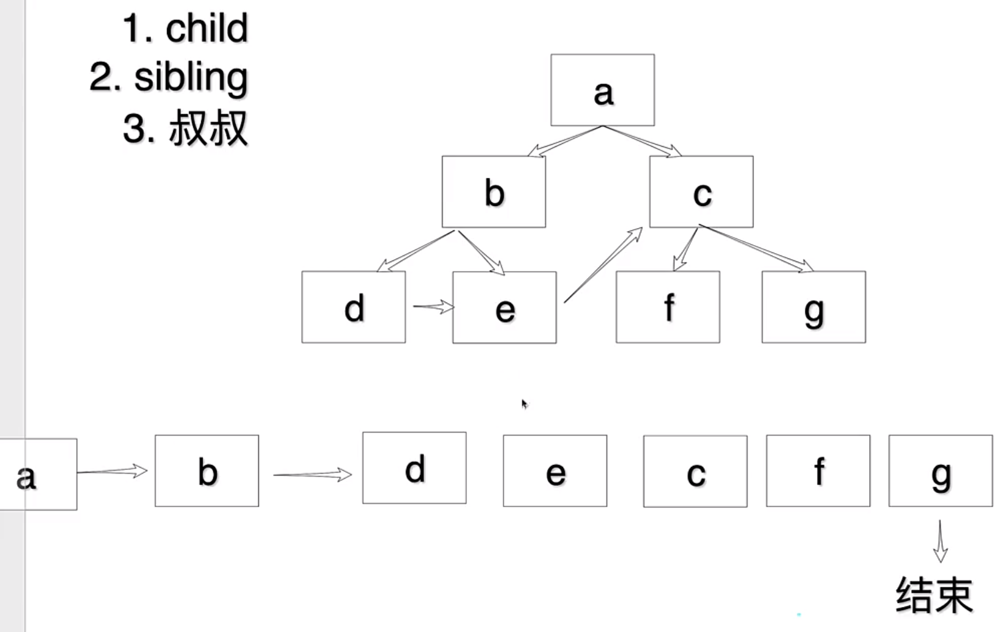

#### 实现转换链表

1.创建一个 performWorkOfUnit 函数，该函数接收一个节点作为参数，并转换链表 设置好指针 2.在 performWorkOfUnit 函数中，返回下一个要执行的任务

React.js

```
// 转换链表
function performWorkOfUnit(work){
    // render的时候已经给了dom  所以判断如果没有dom的时候再创建dom
    if(!work.dom){
        // 1. 创建 dom
        const dom = (work.dom = work.type === "TEXT_ELEMENT" ? document.createTextNode("") : document.createElement(work.type));

        // 父级容器
        work.parent.dom.append(dom);

        // 2. 处理 props
        Object.keys(work.props).forEach((key)=>{
            // 判断一下是不是children属性 不是则直接赋值
            if(key !== "children"){
                dom[key]=work.props[key]
            }
        });
    }
    // 3. 转换链表 设置好指针
    const children = work.props.children || [];
    let prevchild = null;// 上一个孩子节点
    children.forEach((child,index)=>{
        const newWork={// 为了不破坏 vnode (child) 所以新写一个
            type:child.type,
            props:child.props,
            parent:work,
            sibling:null,
            dom:null,
        }
        if(index===0){ // 如果是第一个 就直接放到child 中
            work.child=newWork;
        }else{
            prevchild.sibling=newWork; // 这样就 指向了 C
        }
        prevchild=newWork;
    });

    // 4. 返回下一个要执行的任务
    if(work.child){ // 有孩子节点 返回第一个孩子节点
        return work.child;
    }
    if(work.sibling){ // 没有孩子节点 返回兄弟节点
        return work.sibling;
    }
    return work.parent?.sibling || null;// 没有兄弟节点 返回父节点的兄弟节点
}
```

修改一下 render 函数
React.js

```
function render(el,container){
    // 创建一个根节点 作为任务执行的dom
    nextUnitOfWork={
        dom:container,
        props:{
            children:[el]
        }
    }
}
```

#### 重构代码

创建一个 createDom 函数来创建 dom

再创建一个 updateProps 函数来处理 props

再创建一个 initChildren 函数来处理子节点

并在 performWorkOfUnit 中使用

React.js

```
function createDom(type){
    return type === "TEXT_ELEMENT" ? document.createTextNode("") : document.createElement(type);
}

function updateProps(dom,props){
    Object.keys(props).forEach((key)=>{
        // 判断一下是不是children属性 不是则直接赋值
        if(key !== "children"){
            dom[key]=props[key]
        }
    });
}

function initChildren(fiber){
    // 3. 转换链表 设置好指针
    const children = fiber.props.children || [];
    let prevchild = null;// 上一个孩子节点
    children.forEach((child,index)=>{
        const newFiber={// 为了不破坏 vnode (child) 所以新写一个
            type:child.type,
            props:child.props,
            parent:fiber,
            sibling:null,
            dom:null,
        }
        if(index===0){ // 如果是第一个 就直接放到child 中
            fiber.child=newFiber;
        }else{
            prevchild.sibling=newFiber; // 这样就 指向了 C
        }
        prevchild=newFiber;
    });
}

function performWorkOfUnit(fiber){
    // render的时候已经给了dom  所以判断如果没有dom的时候再创建dom
    if(!fiber.dom){
        // 1. 创建 dom
        const dom = (fiber.dom = createDom(fiber.type));
        // 父级容器
        fiber.parent.dom.append(dom);
        // 2. 处理 props
        updateProps(dom,fiber.props);
    }

    // 3. 转换链表 设置好指针
    initChildren(fiber);

    // 4. 返回下一个要执行的任务
    if(fiber.child){ // 有孩子节点 返回第一个孩子节点
        return fiber.child;
    }
    if(fiber.sibling){ // 没有孩子节点 返回兄弟节点
        return fiber.sibling;
    }
    return fiber.parent?.sibling;// 没有兄弟节点 返回父节点的兄弟节点
}
```

## 统一提交到页面中

问题：我们是使用 requestIdleCallback 来实现的，只有等待浏览器有空闲时间才会执行任务，如果任务很多，那页面渲染就只能看到一半渲染。

解决思路：

计算结束后统一添加到页面中

1. 需要知道链表什么时候结束，当 nextUnitOfWork 为 null 的时候链表就结束了。
2. 需要知道链表的第一个节点，因为需要从第一个节点开始 append。也就是 redner 赋的值，我们用 root 记录这个值。

React.js

```
let root = null;
function render(el, container) {
  nextUnitOfWork = {
    dom: container,
    props: {
      children: [el],
    },
  };

  root = nextUnitOfWork;
}

function workLoop(deadline){
    let shouldYield=false;
    while(nextUnitOfWork && !shouldYield){
        nextUnitOfWork=performWorkOfUnit(nextUnitOfWork);
        shouldYield=deadline.timeRemaining()<1;
    }
    // 链表结束之后调用 append 添加到页面中
    if(!nextUnitOfWork && root){
        commitRoot();
    }
    requestIdleCallback(workLoop);
}
requestIdleCallback(workLoop);

function commitRoot(){
    commitWork(root.child);
    root=null;
}
function commitWork(fiber){
    if(!fiber) return;
    // 找到父级把当前dom添加进去
    filber.parent.dom.append(fiber.dom);
    // 递归添加子节点
    commitWork(fiber.child);
    // 递归添加兄弟节点
    commitWork(fiber.sibling);
}
```

同时把之前在 performWorkOfUnit 中的 append 方法删除
React.js

```
function performWorkOfUnit(fiber){
    // 省略...
    // filber.parent.dom.append(dom);
    // 省略...
}
```

## 实现支持 function component

#### 实现 function component

在 react 中创建一个组件是非常容易的
demo:

```
import React from './core/React';
function MyComponent() {
    return <div>Hello, world!</div>;
}

const App = (
    <div>
    hi-mini-react
    <MyComponent />
    </div>
);

export default App;
```

当前这个例子运行起来会报错，type name 是 function，当前不支持 function component
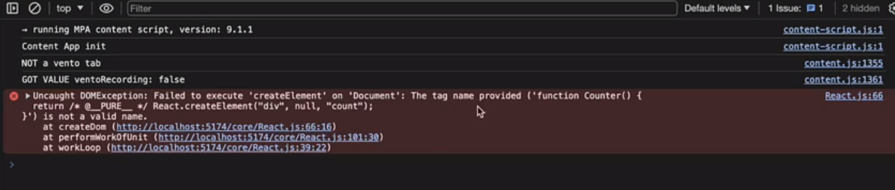
我们怎么才能得到 counter 下的节点尼？
需要调用 function（开箱）
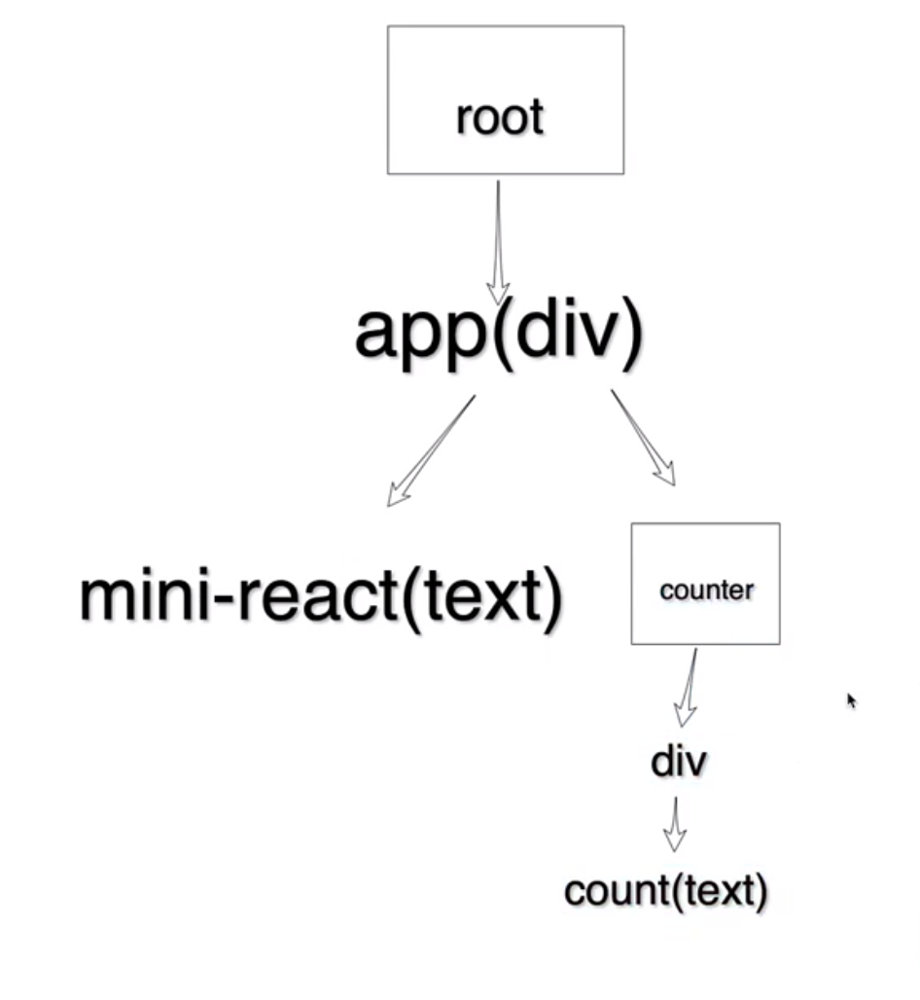
我们在 createWorkInProgress 中添加一个判断，如果 type 是 function 则调用该函数

```
function performWorkOnUnit(fiber){
    const isFunctionComponent = fiber.type instanceof Function;
    if(isFunctionComponent){
        console.log(fiber.type());
    }
    // 省略...
}
```

可以看到我们得到的是一个对象
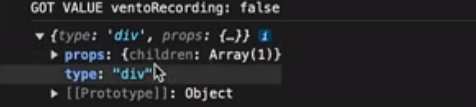

1. 对于我们程序来说 initChildren 需要的是一个数组，可以包裹一下，我们把 initChildren 中处理 children 的提取出来,当作参数传入
2. 对于 function 而言我们不需要创建 dom，所以不是 function 的时候才需要创建 dom

```
function performWorkOnUnit(fiber){
    const isFunctionComponent = fiber.type instanceof Function;
    if(!isFunctionComponent){
        if (!fiber.dom) {
        // 创建节点 先判断一下是text类型么
        const dom = (fiber.dom = createDom(fiber.type));

        // 存放 父级容器
        // fiber.parent.dom.append(dom);
        // 处理props
        updateProps(dom, fiber.props);
        }
    }

    const children=isFunctionComponent?[fiber.type()]:fiber.props.children;
    initChildren(fiber,children);
    // 省略...
}
```

到此我们的页面可以渲染出 hi-mini-react 了，function 的组件还没有展示出来还报了一个错，这是因为我们 function 是没有父级的，子节点没办法 append 挂载
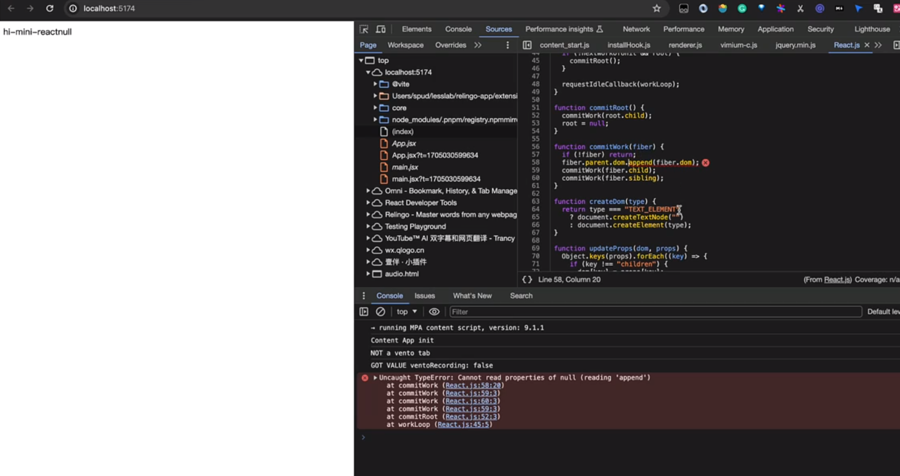
那么怎么解决尼？父类没有是不是可以继续往上找，然后挂载，在统一提交的函数中处理

```
function commitWork(fiber){
    if(!fiber) return;
    let fiberParent=fiber.parent;
    if(!fiberParent.dom){
        fiberParent=fiberParent.parent;
    }
    // 找到父级把当前dom添加进去
    fiberParent.dom.append(fiber.dom);
    // 递归添加子节点
    commitWork(fiber.child);
    // 递归添加兄弟节点
    commitWork(fiber.sibling);
}
```

到这我们可以渲染 function 的组件了，但是还打印了个 null
是因为我们在 append 的时候 把空的也添加进去了
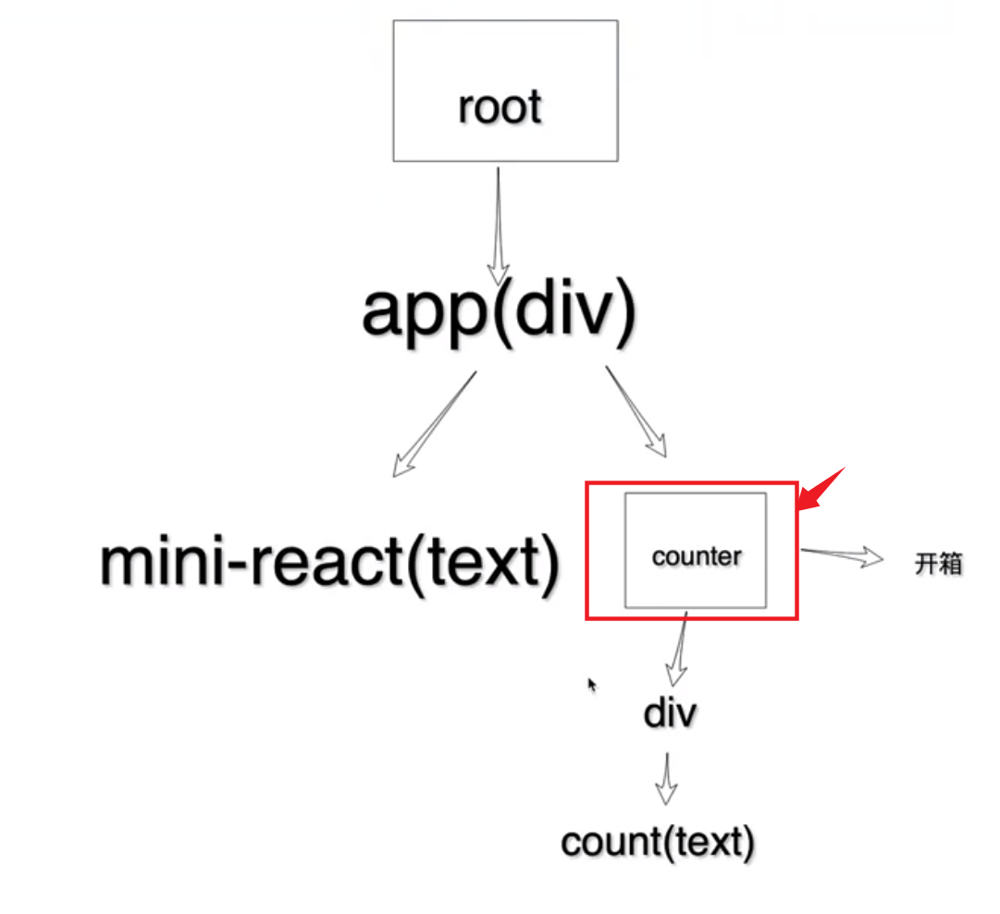
那么怎么处理呢？
我们在 append 的时候 判断一下是不是空的，如果是空的就不添加了

```
// 找到父级把当前dom添加进去
    if(fiber.dom)fiberParent.dom.append(fiber.dom);
```

如果我们的 function component 是嵌套的，那么怎么处理呢？

```
import React from './core/React';
function MyComponent() {
    return <div>Hello, world!</div>;
}
function Component(){
    return (
        <div>
        <MyComponent />
        </div>
    );
}

const App = (
    <div>
    hi-mini-react
    <Component />
    </div>
);

export default App;
```

可以看到报错了，在 append 的时候找不到父级挂载
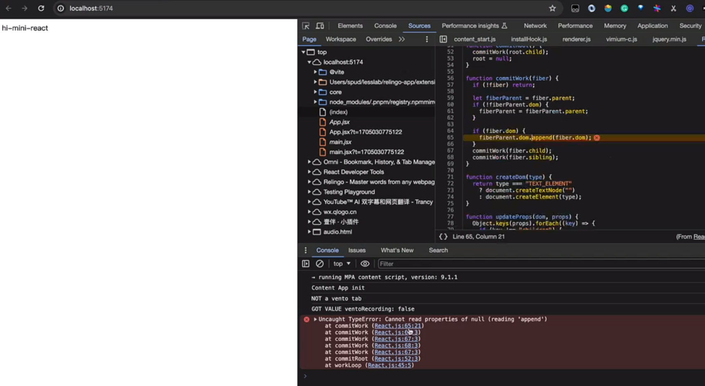
我们在找父级的时候要调整一下,利用 while 循环找到父级,这样就解决嵌套的问题了

```
function commitWork(fiber){
    if(!fiber) return;
    let fiberParent=fiber.parent;
    // 循环找到父级
    while(!fiberParent.dom){
        fiberParent=fiberParent.parent;
    }
    // 找到父级把当前dom添加进去
    fiberParent.dom.append(fiber.dom);
    // 递归添加子节点
    commitWork(fiber.child);
    // 递归添加兄弟节点
    commitWork(fiber.sibling);
}
```

到这，我们就可以愉快的使用 function component 了

App.jsx

```
import React from './core/React';
function MyComponent() {
    return <div>Hello, world!</div>;
}
function Component(){
    return (
        <div>
        <MyComponent />
        </div>
    );
}

function App(){
    <div>
    hi-mini-react
    <Component />
    </div>
};

export default App;
```

main.js 修改成 main.jsx  
以及 index.html 中的main.jsx引用

```
import ReactDOM from "./core/ReactDOM.js";
import React from "./core/React.js";
import App from "./App.jsx";

ReactDOM.createRoot(document.getElementById("root")).render(<App></App>);

```

#### function component 支持 props

App.jsx

```
import React from './core/React';

function Component({num}){
    return (
        <div>
        count:{num}
        </div>
    );
}

function App(){
    <div>
    hi-mini-react
    <Component num={10}/>
    </div>
};

export default App;
```

可以看到目前的实现没有传 props
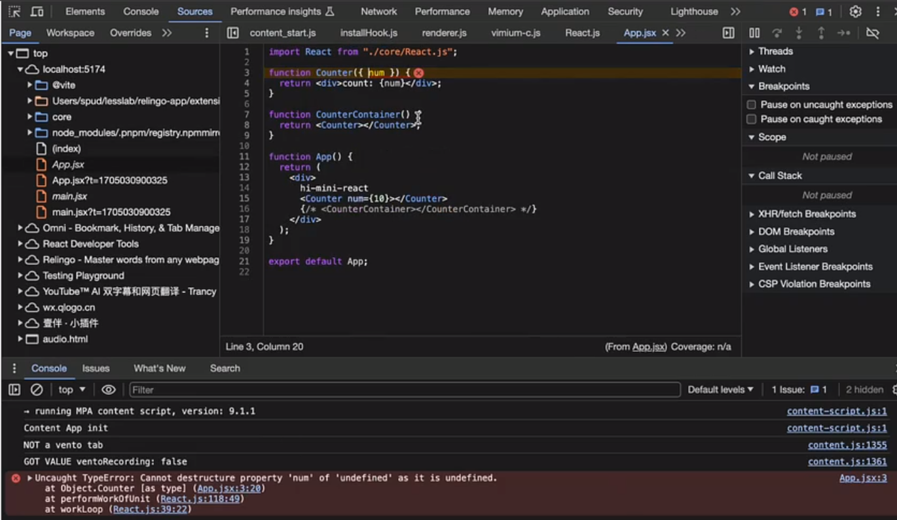

接下来我们实现一下

```
function performWorkOnUnit(fiber){
    // 省略...
    const children=isFunctionComponent?[fiber.type(fiber.props)]:fiber.props.children;
    initChildren(fiber,children);
    // 省略...
}
```

给完之后可以看到还是报错

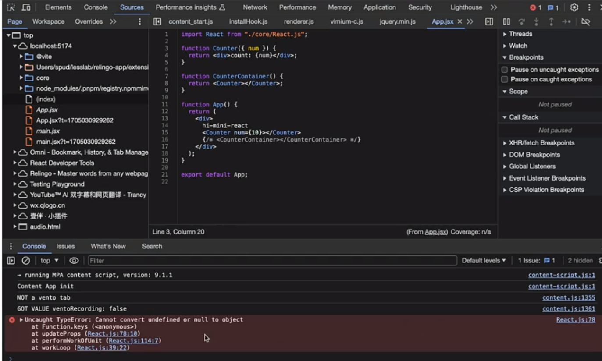
我们之前只处理 string 现在我们传入的是 number 类型，所以把我们传入的 props 当成 child 处理了

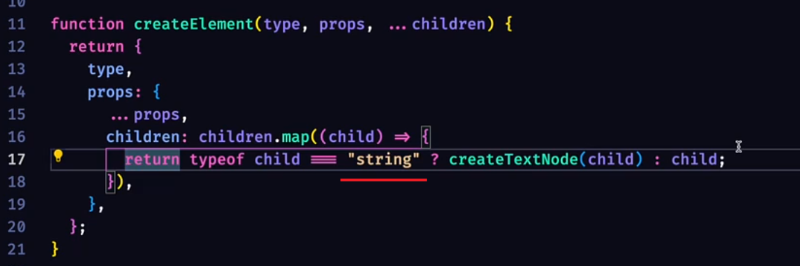
在增加一个 number 类型的判断

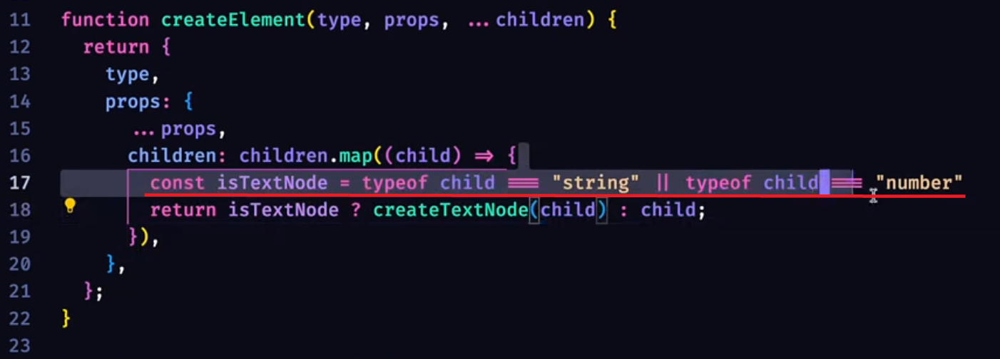

接下来我们调用多个 Component 组件

结构如下
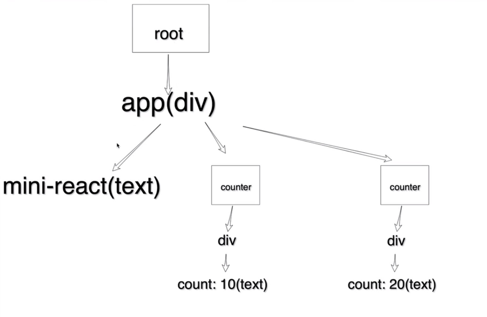

App.jsx

```
import React from './core/React';

function Component({num}){
    return (
        <div>
        count:{num}
        </div>
    );
}

function App(){
    <div>
    hi-mini-react
    <Component num={10}/>
    <Component num={20}/>
    </div>
};

export default App;
```

通过断点调试可以找到 当 function component 的节点都处理完之后，去找父级的父级的兄弟节点时出现的错误。

```
function performWorkOnUnit(fiber){
    // 省略...
    // 返回下一个要执行的任务
  if (fiber.child) {
    // 有孩子节点 返回第一个孩子节点
    return fiber.child;
  }

  let nextFiber = fiber;
  while (nextFiber) {
    if (nextFiber.sibling) {
        // 没有孩子节点 返回兄弟节点
      return nextFiber.sibling;
    }
    nextFiber = nextFiber.parent;
  }
  return null;
}
```

#### 重构代码

抽离一下 处理 function component 的逻辑 以及 非 function component 的逻辑

```
// 处理 function component
function updateFunctionComponent(fiber){
    const children=[filber.type(filber.props)]
    initChildren(fiber,children);
}

// 非 function component
function updateHostComponent(fiber){
    if(!filber.dom){
        const dom = (filber.dom = createDom(fiber.type));

        updateProps(dom,fiber.props);
    }
    const children = fiber.props.children;
    initChildren(fiber,children);
}

function performUnitOfWork(fiber){
    const isFunctionComponent = fiber.type instanceof Function;

    if(isFunctionComponent){
        updateFunctionComponent(fiber);
    }else{
        updateHostComponent(fiber);
    }

    // 省略 ...
}
```

## 实现绑定事件
在 App.jsx 中，添加一个按钮，并绑定点击事件。
```
function Component({ num }) {
  function handleClick(){
    console.log(num);
  }
  return (
    <div>
      count:{num}
      <button onClick={handleClick}>click</button>
    </div>
  );
}
```
我们在 initChildren 函数中打印一下fiber 看看按钮生成的结构

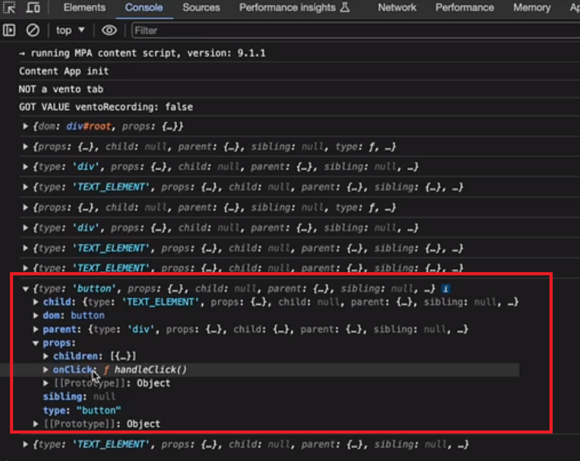

可以看到，按钮生成的 fiber 结构中，找到button结构，它下面的props中还有一个 onClick 属性。

我们可以根据 on 开头的属性名，来确认它是一个事件，然后再绑定到dom上

React.js
```
function updateProps(dom,props){
    Object.keys(props).forEach(key=>{
        if(key.startsWith('on')){
            // 事件名
            const eventName = key.slice(2).toLowerCase();// 或.substring(2);
            dom.addEventListener(eventName,props[key]);
        }else{
            dom[key] = props[key];
        }
    })
}
```

## 实现更新->props
核心：

对比 new vdom tree VS old vdom tree，找出差异，更新dom

1. 如何得到新的 dom 树？
   创建 update 函数，拿到根节点，根节点怎么拿尼？之前我们创建了一个root 变量来存放根节点的，但是不能直接用它，它是处理commitWork(统一提交)时候用的，所以我们创建一个currentRoot变量来存放当前的根节点，在root 被清除之前给它赋值，也就是初始化完页面就赋值了，保证下次更新之前它就有值。
```
let currentRoot=null;

function commitRoot(){
    commitWork(root.child);
    currentRoot=root; // 保证下次更新之前它就有值
    root=null;
}

function update(){
    nextWorkOfUnit={
        dom:currentRoot.dom,
        props:currentRoot.props
    }
    root = nextWorkOfUnit
}
```
2. 如何找到老的节点
    之前我们是把树转变成了链表，新链表的时候我们创建一个属性来指向老俩表的节点，那么我们什么时候构建 新链表尼？在创建链表的时候
   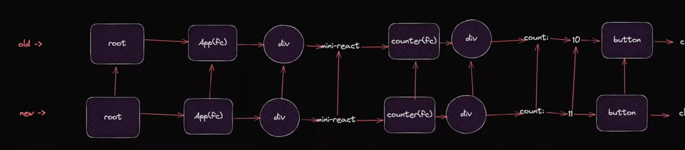
   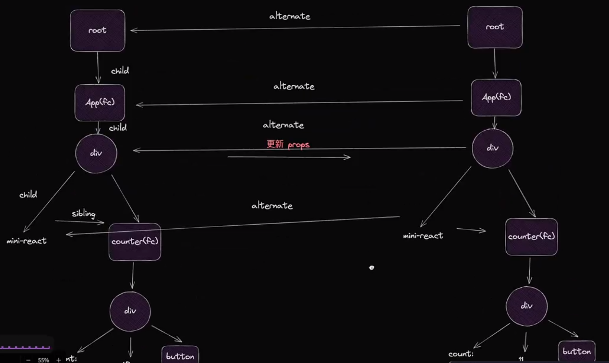
    ```
    function update(){
        nextWorkOfUnit={
            dom:currentRoot.dom,
            props:currentRoot.props,
            alternate:currentRoot  // 指向老链表root
        }
        root = nextWorkOfUnit
    }

    function initChildren(fiber, children) {
        let oldFiber = fiber.alternate?.child;// 存一下老的节点
        // 转换链表 设置好指针
        let prevchild = null; // 上一个孩子节点
        children.forEach((child, index) => {
            const isSameType = oldFiber && child && oldFiber.type === child.type;
            let newFiber;
            if(isSameType){
                 newFiber = {
                    type: child.type,
                    props: child.props,
                    parent: fiber,
                    sibling: null, // 兄弟节点
                    dom: oldFiber.dom,// 更新到老节点上不创建新节点
                    effectTag:'udpate',
                    alternate:oldFiber // 指向老节点
                };
            }else{
                 newFiber = {
                    type: child.type,
                    child:null,
                    props: child.props,
                    parent: fiber,
                    sibling: null, // 兄弟节点
                    dom: null,
                    effectTag:'placement'
                };
            }
            
            if(oldFiber){
                // 指针处理兄弟节点
                oldFiber = oldFiber.sibling;
            }
            if (index === 0) {
             fiber.child = newFiber; // 如果是第一个 就直接放到child 中
            } else {
                prevchild.sibling = newFiber; // 不是第一个 就放到上一个的sibling中
            }
            prevchild = newFiber;
        });
        }

    ```
3. 如何diff props
   对于更新逻辑来说需要得到之前的props 才能进行比较
   ```
   function commitWork(fiber){
        if(!fiber) return;
        let fiberParent=fiber.parent;
        // 循环找到父级
        while(!fiberParent.dom){
            fiberParent=fiberParent.parent;
        }
        // 判断是更新还是创建
        if(fiber.effectTag==='update'){
            updateProps(fiber.dom,fiber.props,fiber.alternate?.props);
        }else if(fiber.effectTag==='placement' && fiber.dom){
            // 找到父级把当前dom添加进去
            fiberParent.dom.append(fiber.dom);
        }
        
        // 递归添加子节点
        commitWork(fiber.child);
        // 递归添加兄弟节点
        commitWork(fiber.sibling);
      }
    // 重构updateProps
    function updateProps(dom,nextProps,prevProps){
        // 1.old 有 new 没有  删除
        // 2.new 有 old 没有 添加
        // 3.old new 都有 更新  2和3 可以合并成一个处理
        // 删除
        Object.keys(prevProps).forEach(key=>{
            if(key!=="children"){
                if(!(key in nextProps)){
                    dom.removeAttribute(key);
                }
            }
        })
        // 更新
        Object.keys(nextProps).forEach(key=>{
            if(key!=="children"){
                if(prevProps[key]!==nextProps[key]){
                    if(key.startsWith('on')){
                        const eventType=key.toLowerCase().substring(2);
                        dom.addEventListener(eventType,nextProps[key]);
                    }else{
                        dom[key]=nextProps[key];
                    }
                }
            }
        })
    } 
   ```
   修改一下 updateProps 调用的地方，然后再添加个count  来更新一下props ,同时别忘记导出 update 函数

   App.jsx
   ```
    import React from "./core/React.js";

    let count=10;
    function Component({ num }) {
    function handleClick(){
        console.log('click');
        count+++
        React.update();
    }
    return (
        <div>
        count:{count}
        <button onClick={handleClick}>click</button>
        </div>
    );
    }
    function App() {
    return (
        <div>
        <div>aaa</div>
        <Component num={10} />
        <Component num={20} />
        <div>
            bbb
            <div>CCC</div>
            <div>DDD</div>
        </div>
        </div>
    );
    }

    export default App;
   ```
测试一下，每次点击 click会掉用很多次
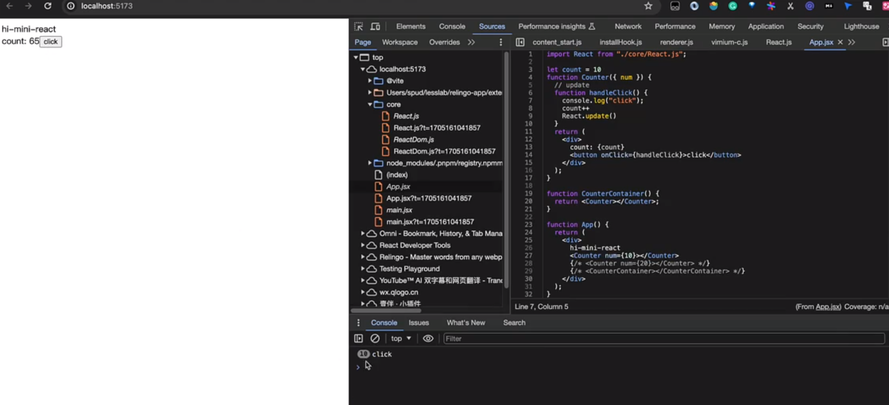
update 的时候 我们只要更新了就给他添加一个addEventListener 事件,每次都挂载到dom上 老的也没有卸载
```
function updateProps(dom,nextProps,prevProps){
       // 省略...
        // 更新
        Object.keys(nextProps).forEach(key=>{
            if(key!=="children"){
                if(prevProps[key]!==nextProps[key]){
                    if(key.startsWith('on')){
                        const eventType=key.toLowerCase().substring(2);
                        dom.removeEventListener(eventType,prevProps[key]);
                        dom.addEventListener(eventType,nextProps[key]);
                    }else{
                        dom[key]=nextProps[key];
                    }
                }
            }
        })
    } 
```

### 重构代码
root 的命名不太合适，正在工作中的root 我们叫它一个 wipRoot
以及 update 函数中的赋值,render 的也换一下
```
function update(){
     wipRoot={
        dom:currentRoot.dom,
        props:currentRoot.props
    }
     nextWorkOfUnit=wipRoot
}
```

initChildren 命名也不太合适，我们叫他一个reconcileChildren

## 更新->创建和删除
### type 不一致 删除旧的 创建新的
之前我们通过 isSameType 来判断是否是同一个type,那么如果是不同的就可以删除oldFiber了，那么我们怎么删除尼？

策略：把需要删除的节点都放到一个数组(deletions)中，最后统一删除在commitRoot函数中遍历deletions，删除所有节点
```
function cimmitRoot(){
    deletions.forEach(commitDeletion)
    // 省略...
}
function commitDeletion(fiber){
    fiber.parent.dom.removeChild(fiber.dom);
}
```
当然这么实现有点不严谨，当我们是function Component时fiber.dom是null，所以我们需要判断一下
```
function commitDeletion(fiber){
    if(fiber.dom){
        fiber.parent.dom.removeChild(fiber.dom);
    }else{
        commitDeletion(fiber.child);
    }
}
```
这样还会又个问题，如果走到了function Component的子节点，那么fiber.parent.dom是null,所以我们需要再循环查找父级
```
function commitDeletion(fiber){
    if(fiber.dom){
        let parentFilber = fiber.parent;
        while (!parentFilber.dom) {
            parentFilber = parentFilber.parent;
        }
        parentFilber.dom.removeChild(fiber.dom);
    }else{
        commitDeletion(fiber.child);
    }
}
```
App.jsx
```
import React from "./core/React.js";

let showBar = false;
function Component() {
  const foo = <div>foo</div>;
  const bar = <div>bar</div>;

  function handleClick() {
    showBar = !showBar;
    React.update();
  }
  return (
    <div>
      <div>{showBar ? bar : foo}</div>
      <button onClick={handleClick}>click</button>
    </div>
  );
}
function App() {
  return (
    <div>
      hi
      <Component />
    </div>
  );
}

export default App;
```

### 新的比老的短 多出来的节点需要删除掉
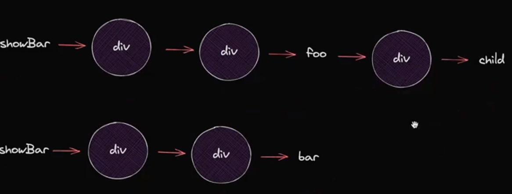
当前我们在处理链表的时候，是基于新child 做的遍历，所以它在处理完新的bar节点之后就不再进行处理了，多出来的节点就没有删除掉   
解决方法：遍历完child之后我们去判断一下 oldFiber 是不是还存在，如果还存在就可以删除多余的节点了
```
function reconcileChildren(fiber, children) {
  let oldFiber = fiber.alternate?.child; // 存一下老的节点
  // 省略...

  if(oldFiber){
    deletions.push(oldFiber);
  }
}
```
我们这只是处理了一个情况，如果我们多个系欸但需要删除尼？
用循环来处理oldFiber，并且让oldFiber指向它的兄弟节点，直到删除完所有的节点
```
function reconcileChildren(fiber, children) {
  let oldFiber = fiber.alternate?.child; // 存一下老的节点
  // 省略...

  while(oldFiber){
    deletions.push(oldFiber);
    oldFiber = oldFiber.sibling;
  }
}
```
### 判断隐藏或显示组件
App.jsx
```
import React from "./core/React.js";

let showBar = false;
function Component() {
const bar=<div>bar</div>;
  function handleClick() {
    showBar=!showBar;
    React.update();
  }
  return (
    <div>
      Component
      <button onClick={handleClick}>click</button>
      {showBar && bar}
    </div>
  );
}
function App() {
  return (
    <div>
        hi-react
      <Component />
    </div>
  );
}

export default App;
```
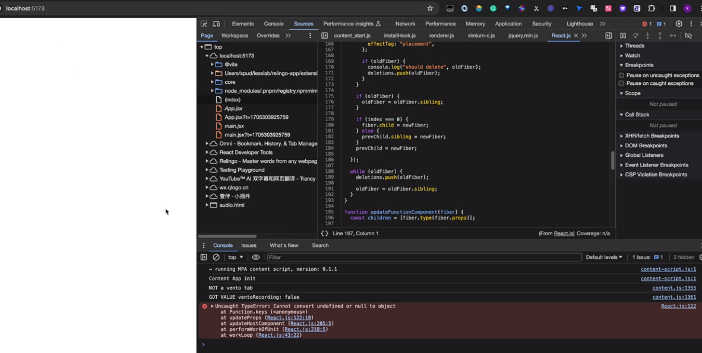
现在肯定是渲染不出来的,首先我们要看看渲染出来的结构对不对，所以我们在 createElement 函数中打印一下 child ，看看是什么结构。
我们可以得到是一个false ,那肯定是false导致的错误了，false不是正常的节点，所以我们需要判断一下，如果 child 是 false 或者 null 的话，我们就不渲染了。
```
function reconcileChildren(fiber, children) {
    // 省略... 
    const isSameType = oldFiber && oldFiber.type === child.type;
    let newFiber;
    if (isSameType) {
      // 省略... 
    } else {
        if(child){ // 当child为false的时候不处理newFiber
            newFiber = {
                type: child.type,
                props: child.props,
                child: null, // 子节点
                parent: fiber,
                sibling: null, // 兄弟节点
                dom: null,
                effectTag: "placement",
            };
        }
    }
    if (oldFiber) {
      oldFiber = oldFiber.sibling;
    }
} 
```
如果我们把App.jsx中的判断逻辑提前到button 上会出现什么问题尼？

会发现它找不到prevChild.sibling了，因为我们之前在最后处理记录上一个节点(prevChild)的时候,是把当前节点赋给它，当我们处理false的时候是没有newFiber的所以导致它在处理下一个节点时候找不到sibling。

我们可以判断一下当前的newFiber是不是存在，如果存在再把上个节点赋值更新
这样我们就能忽略掉节点是false的时候，prevChild还是上一次节点的值
```
function reconcileChildren(fiber, children) {
    // 省略... 
    if(newFiber){
        prevChild = newFiber;
    }
}
```
### 优化更新逻辑
问题点：更新子组件的时候 其他不相关的组件也会重新执行 造成了浪费

App.jsx
```
import React from "./core/React.js";

let count = 1;
function Component() {
  console.log("Component");
  const bar = <div>bar</div>;
  const update = React.update();
  function handleClick() {
    count++;
    update();
  }
  return (
    <div>
      Component
      {count}
      <button onClick={handleClick}>click</button>
    </div>
  );
}
let countBar = 1;
function Bar() {
  console.log("bar");
  const update = React.update();
  function handleClick() {
    countBar++;
    update();
  }
  return (
    <div>
      <h1>Bar</h1>
      {countBar}
      <button onClick={handleClick}>click</button>
    </div>
  );
}
function App() {
  console.log("app");
  return (
    <div>
      hi-react
      <Component />
      <Bar />
      <div>1234</div>
    </div>
  );
}

export default App;

```
目前实现的逻辑，只要是修改了组件，就会重新渲染整个组件树，造成性能浪费

解决方案：
1. 开始节点 : 当前更新的组件

我们在处理 updateFunctionComponent 的时候，把当前的节点赋值给 wipFiber全局变量 存一下

在update 函数的时候利用闭包的特性，把当前的节点赋值给存到currentFiber 中
```
function update(){
    let currentFiber=wipFiber;
    return ()=>{
        ...currentFiber,
        alternate:currentFiber
    }
}
```
App.jsx 中要一下update的调用方式
```
const update=React.update();
function handleClick(){
    count++;
    update();
}
```

2. 结束点 ： 遍历完当前组件的子组件的时候，当下一个节点是处理兄弟节点的时候
在 workLoop 函数中 获取下一个任务的时候(nextWorkOfUnit) 去检测一下，下一个任务是不是兄弟节点,如果是就把nextWorkOfUnit 设置成undefined 结束更新
```
function workLoop(deadline) {
    let shouldYield=false;
    while(nextWorkOfUnit && !shouldYield){
        nextWorkOfUnit=performUnitOfWork(nextWorkOfUnit);

        // 判断下一个节点是处理兄弟节点
        if(wipRoot?.sibling?.type===nextWorkOfUnit?.type){
            nextWorkOfUnit=undefined;
        }

        shouldYield=deadline.timeRemaining()<1;
    }
    // 省略...
}
```
这样我们就可以做到，每次只更新当前的组件以及子组件了，react 中的优化点，把需要更新的拆成小组件，这样可以节约时间，提高性能。

## 实现useState
在 react 中 当state 发生改变的时候，组件才会更新
useState 是一个 hook 函数，它接收一个初始值作为参数，并返回一个数组包含一个状态变量和一个更新状态的函数。
App.jsx 
```
function Foo(){
    const [count,setCount]=React.useState(10);
    function handleClick(){
        setCount(count+1);
    }
    return (
        <div>
            <p>{count}</p>
            <button onClick={handleClick}>+1</button>
        </div>
    )
}
```
第一步实现正常展示：
创建 useState,并返回一个数组，数组中包含当前状态和更新状态的函数
```
function useState(initialValue){
    const stateHook={
        state:initialValue,
    }
    function setState(action){
    }
    return [stateHook.state,setState]; // 数组返回不限制引用时候的名称
}
```
第二步实现更新：
在 setState 函数中，把新的状态值赋值给 stateHook.state，并触发更新
当前 action 是一个函数,所以调用 action() 并传入之前的 stateHook.state
```
function useState(initialValue){
    let currentFiber = wipFiber;
    const stateHook={
        state:initialValue,
    }
    function setState(action){
      stateHook.state=action(stateHook.state);

      wipRoot = {
        ...currentFiber,
        alternate: currentFiber,
      };

      nextUnitOfWork = wipRoot;
    }
    return [stateHook.state,setState]; // 数组返回不限制引用时候的名称
}
```
当我们再次调用返回的 setState ，又会重新创建state，初始值应该是11 而不是10 ，我们代码需要存一下老的state值
我们可以通过指针找到老的state值，然后赋值给新的state

wipRoot 被赋值之后 又会重新执行useState 函数
```
function useState(initialValue){
    let currentFiber = wipFiber;
    const oldHook = currentFiber?.alternate?.stateHook
    const stateHook={
        state:oldHook?oldHook.state:initialValue,
    }
    currentFiber.stateHook = stateHook;
    function setState(action){
      stateHook.state=action(stateHook.state);

      wipRoot = {
        ...currentFiber,
        alternate: currentFiber,
      };

      nextUnitOfWork = wipRoot;
    }
    return [stateHook.state,setState]; // 数组返回不限制引用时候的名称
}
```
第三步:当用户创建多个setState的时候
当前我们的stateHook 只有一个，我们还需要创建多个stateHook
需要用数组来存储 创建 stateHooks ,在updateFunctionComponent 的时候，将 stateHooks=[] 初始化
接下来把我们的stateHook 存储到 stateHooks 数组中
```
function 在updateFunctionComponent(fiber){
    stateHooks=[];
    // 省略...
}

let stateHooks;
function useState(initialValue){
    // 省略...

    stateHooks.push(stateHook);

    currentFiber.stateHooks = stateHooks;
}
```

接下来我们怎么把对应的 hooks 取出来尼？
我们可以通过创建的顺序，来获取对应的 hooks，我们创建一个 stateHookIndex 变量，来记录当前的 hooks 索引,在updateFunctionComponent 的时候，将 stateHookIndex=0 初始化

```
function 在updateFunctionComponent(fiber){
    stateHooks=[];
    stateHookIndex=0;
    // 省略...
}

let stateHooks;
let stateHookIndex;
function useState(initialValue){
    // 省略...
    const oldHook=currentFiber.alternate?.stateHooks[stateHookIndex];
    // 省略...
    stateHookIndex++;
    stateHooks.push(stateHook);

    currentFiber.stateHooks = stateHooks;
}
```
react useState不能在if语句中使用，因为useState会基于创建的顺序来获取对应的 hooks

App.jsx
```
import React from "./core/React.js";

function Foo() {
  const [count, setCount] = React.useState(10);
  const [bar, setBar] = React.useState("bar");
  function handleClick() {
    setCount((c) => c + 1);
    setBar((b) => b + "bar");
  }
  return (
    <div>
      <p>{count}</p>
      <div>{bar}</div>
      <button onClick={handleClick}>+1</button>
    </div>
  );
}

let showBar = false;
function Component() {
  const bar = <div>bar</div>;
  const update = React.update();
  function handleClick() {
    showBar = !showBar;
    update();
  }
  return (
    <div>
      Component
      <button onClick={handleClick}>click</button>
      {showBar && bar}
    </div>
  );
}
function App() {
  return (
    <div>
      hi
      <Foo />
    </div>
  );
}

export default App;
```

### 批量执行action
react 中并不是每次调用setCount就执行更新的，而是先收集起来，然后等到下次调用useState 的时候，再批量执行，达到优化的效果。

对于我们现在实现的mini-react 不存在这种每调用一次就更新视图的问题，因为不管是setCount还是setBar 都是调用setState 因为是同步的所以每次都会调用一遍 setState ，不会去执行workLoop 中的sibling 判断逻辑.

写法上还是模仿一下 react
在 stateHook 中添加 queue 队列
```
function useState(initial){
    const stateHook={
        // 省略...
        queue:[],// 新增队列属性，用于存储action
    }

    stateHook.queue.forEach((action)=>{
        stateHook.state=action(stateHook.state);
    })

    stateHook.queue=[];

    // 省略...

    function setState(action){
        stateHook.queue.push(action);

        // 省略...

    }

// 省略...
}
```

支持一下传入 非function的写法
```
function useState(initial){
     // 省略...

    function setState(action){
        stateHook.queue.push(typeof action === 'function'?action:()=>action);

        // 省略...

    }

// 省略...
}
```

### 提前检测 减少不必要的更新

比如更新之前是 1 更新之后还是 1 那么我们就可以不做处理了
```
function useState(initial){
    const eagerState = typeof action === 'function'?action(stateHook.state):action;

    if(eagerState === stateHook.state) return; // 提前检测，减少不必要的更新
     // 省略...
}
```

## useEffect 实现
useEffect 调用的时机是在 React 完成对 DOM 的渲染之后，并且浏览器完成绘制之前。

useEffect 的第二个参数是依赖数组，不指定的时候副作用指挥在组件渲染后执行一次，如果指定了依赖数组，那么只有当依赖数组中的值发生变化时，副作用才会执行。

App.jsx
```
useEffect(()=>{
    console.log('init');
},[]);
useEffect(()=>{
    console.log('update');
},[count]);
```
### 实现初始化 useEffect
在 React.js 中创建 useEffect 函数,来收集用户传入进来的effectHook 
```
function useEffect(callback,deps){
    const effectHook={
        callback,
        deps
    }
    wipFiber.effectHook=effectHook;
}
```

在 React 完成对 DOM 的渲染之后,执行effectHook.callback 函数。如果依赖数组发生变化，则执行effectHook.callback 函数。
```
function commitRoot(){
    // 省略...
    commitWork(wipFiber.child);
    commitEffectHook()
}
```
那么我们怎么找到这个effectHook呢？我们需要从根节点依次递归寻找如果存在effectHook 就执行 effectHook.callback
```
function commitEffectHook(){
    function run(fiber){
        if(!fiber) return;
        fiber.effectHook?.callback();
        run(fiber.child);
        run(fiber.sibling);
    }

    run(wipFiber)
}
```

### 实现带有依赖项的 useEffect
更新的时候需要检测依赖项是否发生变化，如果发生变化则执行effectHook.callback 函数。

通过fiber.alternate来判断是初始化还是更新，如果是更新则需要检测依赖项是否发生变化。
利用 some 方法来判断依赖项是否发生变化。

```
function commitEffectHook(){
    function run(fiber){
        if(!fiber) return;

        if(fiber.alternate){
            // update
            // 检测 deps 有没有发生改变
            const oldEffectHook=fiber.alternate?.effectHook;
            const needUpdate=oldEffectHook?.deps?.some((item,index)   =>item!==fiber.effectHook.deps[index]
            );
            needUpdate && fiber.effectHook.callback();
        }else{
            // init
            fiber.effectHook?.callback();
        }
        run(fiber.child);
        run(fiber.sibling);
    }

    run(wipFiber)
}
```

### 实现支持多个effectHook的 useEffect
创建数组 effectHooks 全局变量,在 updateFuncionComponent 函数中初始化 effectHooks=[]

然后在 useEffect 的时候存一下所有的effectHooks

任务拆分思想小技巧：在实现功能的时候不要去考虑如何重构、如何去设计，先实现功能，然后再考虑如何优化。把事情变得简单点。
```
let effectHooks;
function useEffect(callback,deps){
    const effectHook={
        callback,
        deps
    }

    effectHooks.push(effectHook);
    wipFiber.effectHooks=effectHooks;
}

function commitEffectHook(){
    function run(fiber){
        if(!fiber) return;

        if(fiber.alternate){
            // update
            // 检测 deps 有没有发生改变
            fiber.effectHooks?.forEach((newHook,index)=>{
                if(newHook.deps.length>0){
                    const oldEffectHook=fiber.alternate?.effectHook;
                    const needUpdate=oldEffectHook?.deps?.some((item,i)   =>item!==newHook.deps[i]
                    );
                    needUpdate && newHook.callback();
                }
            })
            
        }else{
            // init
            fiber.effectHooks?.forEach(hook=>hook.callback());
        }
        run(fiber.child);
        run(fiber.sibling);
    }

    run(wipFiber)
}
```

## cleanup 实现
cleanup 就是 effectHook 中的 callback 执行的时候，会先执行 cleanup 中的函数，然后执行 callback 中的函数,当 deps 为空的时候不会调用返回的 cleanup
cleanup 的作用是为了清空副作用

那么我们存在哪里？可以存在 effectHook 中

```
function useEffect(callback,deps){
    const effectHook={
        callback,
        deps,
        cleanup:null
    }

    effectHooks.push(effectHook);
    wipFiber.effectHooks=effectHooks;
}
```
当我们执行 callback() 的时候 返回 cleanup 函数
```
function commitEffectHook(){
    function run(fiber){
        if(!fiber) return;

       // 省略...
       hook.cleanup=hook.callback();
       // 省略...
    }

    function runCleanup(fiber){
        if(!fiber) return;
        fiber.alternate?.effectHooks?.forEach(hook=>{
            if(hook.deps.length>0){
                hook.cleanup&&hook.cleanup();
            }
        }); // 执行 cleanup 函数，清空副作用
        runCleanup(fiber.child);
        runCleanup(fiber.sibling);
    }
    runCleanup(wipRoot)
    run(wipRoot);
}
```