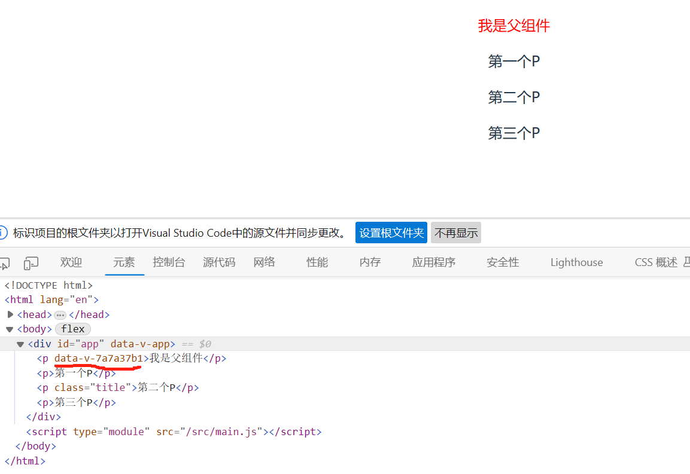
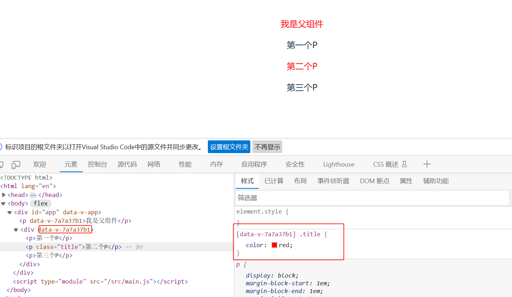
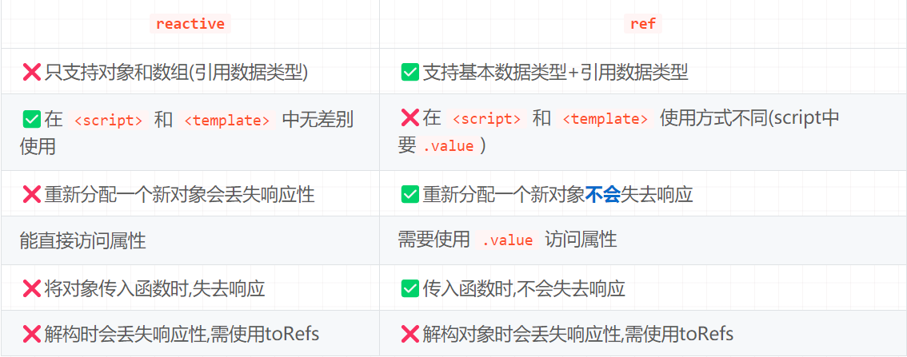

# vue开发小技巧，让效率翻倍

## 使用 computed 函数来计算属性
 在 Vue 3 中，你可以同时使用 v-for 和 v-if 指令，但它们的使用是有顺序的，v-for 必须位于 v-if 之前
 在 Vue 3 中，当你需要在计算属性中过滤数组，并将其显示在模板中时，使用 computed 函数。computed 函数允许你编写复杂的逻辑，从而过滤数组。你也可以使用 computed 函数来计算属性。

computed 函数会监听你传递给它的响应式对象的变化。当这些对象发生变化时，computed 函数会返回新的计算结果。
 computed 使用计算属性过滤数组。
 场景1：
 当过滤数组时，你可以使用 computed 函数来返回一个新的数组，该数组只包含满足条件的元素。
 ```
 <template>
  <div v-for="item in filteredArr" :key="item.id">
    <h3>{{ item.title }}</h3>
  </div>
</template>

<script setup>
import { computed, ref } from "vue";

const arr = ref([
  { id: 1, title: "Title 1" },
  { id: 2, title: "Title 2" },
  { id: 3, title: "Title 3" },
  { id: 4, title: "Title 4" },
  { id: 5, title: "Title 5" },
]);

const filteredArr = computed(() => arr.value.filter((item) => item.id !== 3));
</script>

<style scoped lang="scss"></style>

 ```

场景2：
当我有两个数组，想要根据页面某个属性选择的不同来展示不同的数组时，
可以使用computed函数，通过判断页面选择的不同来返回不同的数组
 ```
 <template>
  <button @click="showArr = !showArr">按钮</button>
  <div v-for="item in filteredArr" :key="item.id">
    <h3>{{ item.title }}</h3>
  </div>
</template>

<script setup>
import { computed, ref } from "vue";

const arr = ref([
  { id: 1, title: "Title 1" },
  { id: 2, title: "Title 2" },
  { id: 3, title: "Title 3" },
  { id: 4, title: "Title 4" },
  { id: 5, title: "Title 5" },
]);

const arr2 = ref([
  { id: 1, title: "Title2 1" },
  { id: 2, title: "Title2 2" },
  { id: 3, title: "Title2 3" },
]);
const showArr = ref(true);

const filteredArr = computed(() => (showArr.value ? arr.value : arr2.value));
</script>

<style scoped lang="scss"></style>

 ```

## 使用结构化赋值
v-for 其实还有另外一种写法，使用结构化赋值，可以减少代码量，提高可读性。
```
<template>
  <div>
    <ul>
      <li v-for="{ id, title } in arr" :key="id">
        {{ id }} - {{ title }}
      </li>
    </ul>
  </div>
</template>

<script setup>
import { ref } from "vue";

const arr = ref([
  { id: 1, title: "Title 1" },
  { id: 2, title: "Title 2" },
    ]);
</script>

<style scoped lang="scss"></style>

```

## vue3 穿透样式不生效？
我们先来看一下代码
父类组件：
```
<template>
  <p>我是父组件</p>
  <Bar />
</template>

<script setup>
import Bar from './Bar.vue'
</script>

<style scoped lang="scss">
p {
  color: red;
}
:deep(.title) {
  color: red;
}
</style>

```

子组件：
```
<template>
  <p>第一个P</p>
  <p class="title">第二个P</p>
  <p>第三个P</p>
</template>

<script setup></script>

<style scoped lang="scss"></style>

```

父类创建了一个穿透样式 .title ，并且template 中分别是p和bar组件，是两个根节点
在页面上生成的效果是：


我们写了一个穿透样式，但是没有生效，在整个style会存在一个跟容器，我们父类代码中存在两个根，一个是P一个是Bar

这个根有什么用尼？
实际上是决定我们的 scoped 加在哪个根上，所以当前的demo 穿透样式前缀data-v-7a7a37b1 加在的父类的P标签上,导致穿透样式失效
它为什么没有在 Bar组件是加上data-v-7a7a37b1 因为bar组件也没有根 
解决办法：
只有在 [data-v-7a7a37b1] .title 这样写才能生效

我们给父类最外层加上一个根,或者给Bar 加上一个根 可以用div包裹
两种都可以 我们演示一下 第二种
```
<template>
  <div>
    <p>第一个P</p>
    <p class="title">第二个P</p>
    <p>第三个P</p>
  </div>
</template>

<script setup></script>

<style scoped lang="scss"></style>
```


## 自定义Hooks
#### 自定义hook需要满足的规范
1、具备可复用功能，才需要抽离为hooks独立文件

2、函数名/文件名以use开头，形如: useXX

3、引用时将响应式变量或者方法显式解构暴露出来；
示例如下：
```
const { nameRef,Fn }= useXX()
```

#### hooks和utils区别
相同点： 通过hooks和utils函数封装， 可以实现组件间共享和复用，提高代码的可重用性和可维护性。

异同点：
1.表现形式不同： hooks是在 utils 的基础上再包一层组件级别的东西(钩子函数等)；utils一般用于封装相应的逻辑函数，没有组件的东西；
2.数据是否具有响应式： hooks 中如果涉及到 ref，reactive，computed 这些 api 的数据，是具有响应式的；而 utils 只是单纯提取公共方法就不具备响应式；
3.作用范围不同： hooks封装，可以将组件的状态和生命周期方法提取出来，并在多个组件之间共享和重用；utils通常是指一些辅助函数或工具方法，用于实现一些常见的操作或提供特定功能。

总结：
utils是通用的工具函数，而hooks是对utils的一种封装，用于在组件中共享状态逻辑和副作用。
通过使用hooks，您可以简化代码，并使其更具可读性和可维护性。

函数示例：
```
import { ref, onMounted, computed } from 'vue';
 
export default function useCount {
  
    const count = ref(0);   

    const doubleCount = computed(
      () => count.value * 2
    );
    
     const increase = (delta) => {
        return count.value + delta;
    }    
    
    return {
      count,
      doubleCount,
      increase  
    };
 
}
```
在组件中调用：
```
<script setup lang="ts">
    import useCount from "@/hooks/useCount";
    const { count,doubleCount,increase } = useCount;
    const newCount = increase(10); // 输出: 10       
</script>
```

理解了hooks之后，我们的业务代码其实就可以写的更加的优雅了。

## 为什么推荐使用ref而不是reactive
reactive本身具有很大局限性导致使用过程需要额外注意,如果忽视这些问题将对开发造成不小的麻烦;ref更像是vue2时代option api的data的替代,可以存放任何数据类型,而reactive声明的数据类型只能是对象;

非必要不用reactive! (官方文档也有对应的推荐)
官方原文:建议使用 ref() 作为声明响应式状态的主要 API。

#### reactive和 ref 对比



#### 原因1:reactive有限的值类型
reactive只能声明引用数据类型(对象)
ref既能声明基本数据类型,也能声明对象和数组;

#### 原因2:reactive使用不当会失去响应
reactive一时爽,使用不恰当的时候失去响应泪两行,开开心心敲代码过程中,会感叹!!咦?怎么不行?为什么这么赋值失去响应了?
通常在页面数据回显时,需要将AJAX请求获取的对象直接赋值给响应式对象,如果操作不当就导致reactive声明的对象失去响应
例1：赋值一个普通对象
```
let state = reactive({ count: 0 })
//这个赋值将导致state失去响应
state = {count: 1}
```

解决方法:
不要直接整个对象替换,对象属性一个个赋值
```
let state = reactive({ count: 0 })
//state={count:1}
state.conut = 1

// 或者使用Object.assign
state = Object.assign(state , {count:1})

// 或者使用ref定义对象
let state = ref({ count: 0 })
state.value={count:1}
```

例2：赋值一个reactive对象
```
<template>
  {{state}}
</template>    
​
<stcirpt setup>
const state = reactive({ count: 0 })
 //nextTick异步方法中修改state的值
nextTick(() => {
  //并不会触发修改DOM  ,说明失去响应了
  state = reactive({ count: 11 });
});
</stcirpt>
```
在nexTick中给state赋值一个reactive的响应式对象,但是DOM并没有更新!


例3：直接reactive对象解构时
```
let state = reactive({ count: 0 })
//普通解构count 和 state.count 失去了响应性连接
let { count } = state 
count++ // state.count值依旧是0
```
解决方案：
使用toRefs解构不会失去响应
```
const state = reactive({ count: 0 })
//使用toRefs解构,后的属性为ref的响应式变量
let { count } = toRefs(state)
count.value++ // state.count值改变为1
```

为什么同样是赋值对象ref不会失去响应而reactive会?

ref 定义的数据（包括对象）时，返回的对象是一个包装过的简单值，而不是原始值的引用;
就和对象深拷贝一样,是将对象属性值的赋值

reactive定义数据（必须是对象），reactive返回的对象是对原始对象的引用，而不是简单值的包装。

类似对象的浅拷贝,是保存对象的栈地址,无论值怎么变还是指向原来的对象的堆地址;
reactive就算赋值一个新的对象,reactive还是指向原来对象堆地址

#### 建议: ref一把梭
有的人会觉得 ref的.value小尾巴好麻烦!

volar插件能自动补全.value 
valor 自动补全.value (不是默认开启,需要手动开启)
注意：
volar插件需要安装在vscode插件中

