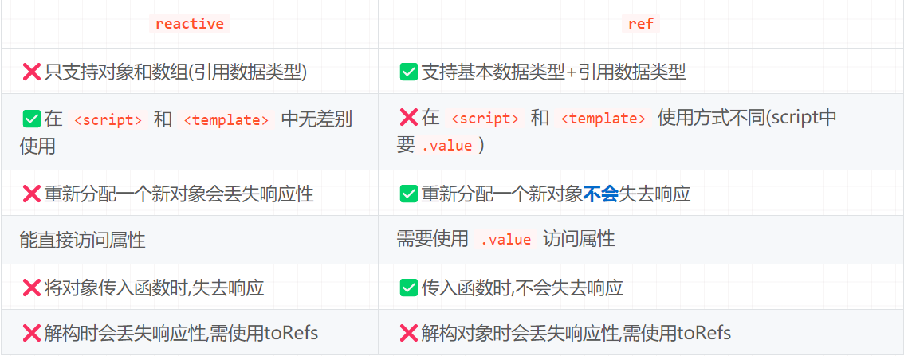

## 打卡第一天
1. 第一感觉和vue 好像啊 有种在写mini-vue 的感觉，语言都是相同的
2. 循序渐进的写出来，知道要的结构是什么样子然后逐步完善代码，和单测思想比较接近

问题 递归调用的render,渲染过多的时候会出现渲染一半的情况，导致性能问题，页面应该会不渲染了

学到了：
1.vite 可以直接使用jsx语法，不用再引入jsx了
2. // const App = React.createElement("div",{id:"app"},"app-hhh");
const App = 
app-hhh

很神奇 竟然两种写法都是调用 React.createElement创建App 而且还是调用的自己写的React.createElement 

github:https://github.com/33765534/hl-mini-react

## 打卡第二天

学到了:
1. 知道了浏览器函数 requestIdleCallback, 浏览器空闲的时候执行回调函数,以及timeRemaining方法返回当前帧还剩余多少时间，单位是毫秒。同时借助这个方法，可以实现一些优化操作
2. 从react的渲染问题了解了 fiber 调度器，从而又想到了 vue 的nextTick 原理(Promise)，都是利用宏任务和微任务，来保证代码的执行顺序

工作中的灵感：
工作中加载js过多或者图片过多的时候也可以用 requestIdleCallback 来优化一下
把 js 拆分成多个小文件，然后通过 requestIdleCallback 去加载

github:https://github.com/33765534/hl-mini-react

## 打卡第三天
学到了：
1. 别人解决问题的思路： requestIdleCallback 空闲的时候才会执行，页面渲染一半怎么办？等到处理完再一次性把 vnode 渲染到dom 中。
2. 通过问题的形式，来思考问题，而不是直接解决问题。这种方式，可以锻炼自己的思维能力。这种思维方式，可以应用到工作中。
3. 重构代码的思维，把代码拆分成多个小模块，然后通过组合的方式，来完成整个功能。做到职责单一，后续代码维护起来更加方便。

github:https://github.com/33765534/hl-mini-react

## 打卡第四天
复习：
第一节：
1. 用真实dom写死实现，然后通过写死 vnode 渲染到真实dom 
2. 对应 React 的api ReactDOM、render、createElemnt 实现创建真实dom、渲染真实dom、创建vnode
3. 使用 vite 集成 jsx
第二节：
1. requestIdleCallback 实现任务调度，空闲的时候执行回调函数，并且通过 timeRemaining 方法控制执行时间
2. 实现了 fiber 数据结构(链表)，并且实现了 fiber 调度器，通过调度器来控制 fiber 节点的执行顺序
第三节：
1. 实现统一创建真实dom
2. function Component 的实现，区分fc和非fc，fc的时候添加dom的处理

## 打卡第五天
学习内容：
1. 目标事件绑定，先观察结构进行分析，再写代码，这样写出来的代码更加清晰
2. 目标实现更新，创建 update 函数，用户通过调用 update 函数来更新组件
3. 添加 alternate 属性来指向老的节点，从而实现快速查找并更新
4. updateProps 来实现 删除 或者添加更新 props

调试了好久，才把目标实现了，但是收获很大，遇到解决不了的又快熟看一遍视频，再写代码，这样写出来的代码更加清晰。

github:https://github.com/33765534/hl-mini-react

## 打卡第六天
学到了：
通过不同的场景，更新迭代代码，根据不同的case 处理不同的场景如：
    1.type 不一致 删除旧的 创建新的,把需要删除的节点都放到一个数组最后统一删除
    2.新的比老的短 多出来的节点需要删除掉，用循环来处理oldFiber，并且让oldFiber指向它的兄弟节点，直到删除完所有的节点
    3.判断隐藏或显示组件
    4.优化了更新组件，不想管的组件不重新执行，避免造成计算浪费，开始节点：updateFunctionComponent 的时候，把当前的节点赋值给 wipFiber全局变量,update的时候通过闭包的特性，把当前的节点赋值给存到currentFiber 中，结束节点：判断下一个任务是不是兄弟节点

统一删除 别忘记删除完要清空 deletions，今天忘记清空，找了好久的bug 

github:https://github.com/33765534/hl-mini-react

## 打卡第七天
学到了：
useState 是一个 hook 函数，它接收一个初始值作为参数，并返回一个数组包含一个状态变量和一个更新状态的函数。react useState不能在if语句中使用，因为useState会基于创建的顺序来获取对应的 hooks
react 的useState接收一个参数作为初始值，并返回一个数组，一个值是属性值，一个值是set函数接收之前的值以及返回修改后的值。
利用alternate指针存放老的stateHook，在创建全局变量stateHooks来存放每个stateHook，以及创建stateHookIndex 索引来取之前的hooks.
实现统一赋值，在stateHook中增加queue队列吧action都收集起来。在下一次调用useState的时候赋值，复制完吧队列清空。
优化useState如果值没有修改的情况下就不修改

github:https://github.com/33765534/hl-mini-react

## 打卡第八天
学到了：
useEffect 是一个 hook 函数，它接收一个函数作为参数，并返回一个函数。react useEffect不能在if语句中使用，因为useEffect会基于创建的顺序来获取对应的 hooks
useEffect 调用的时机是在 React 完成对 DOM 的渲染之后，并且浏览器完成绘制之前。
useEffect 的第二个参数是依赖数组，不指定的时候副作用指挥在组件渲染后执行一次，如果指定了依赖数组，那么只有当依赖数组中的值发生变化时，副作用才会执行。
在 React 完成对 DOM 的渲染之后,执行effectHook.callback 函数。如果依赖数组发生变化，则执行effectHook.callback 函数。
更新的时候需要检测依赖项是否发生变化，如果发生变化则执行effectHook.callback 函数。

通过fiber.alternate来判断是初始化还是更新，如果是更新则需要检测依赖项是否发生变化。
利用 some 方法来判断依赖项是否发生变化。
创建数组 effectHooks 全局变量,在 updateFuncionComponent 函数中初始化 effectHooks=[]

然后在 useEffect 的时候存一下所有的effectHooks

cleanup 就是 effectHook 中的 callback 执行的时候，会先执行 cleanup 中的函数，然后执行 callback 中的函数,当 deps 为空的时候不会调用返回的 cleanup
cleanup 的作用是为了清空副作用

任务拆分思想小技巧：在实现功能的时候不要去考虑如何重构、如何去设计，先实现功能，然后再考虑如何优化。把事情变得简单点。

github:https://github.com/33765534/hl-mini-react

