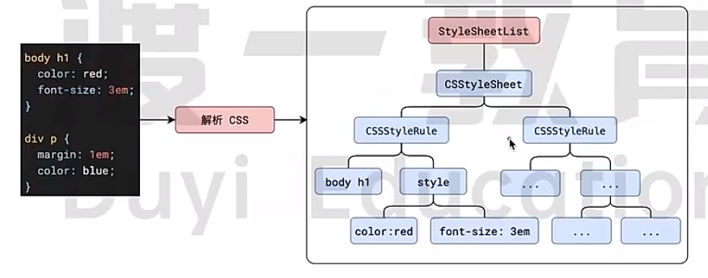
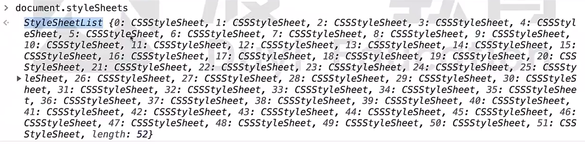
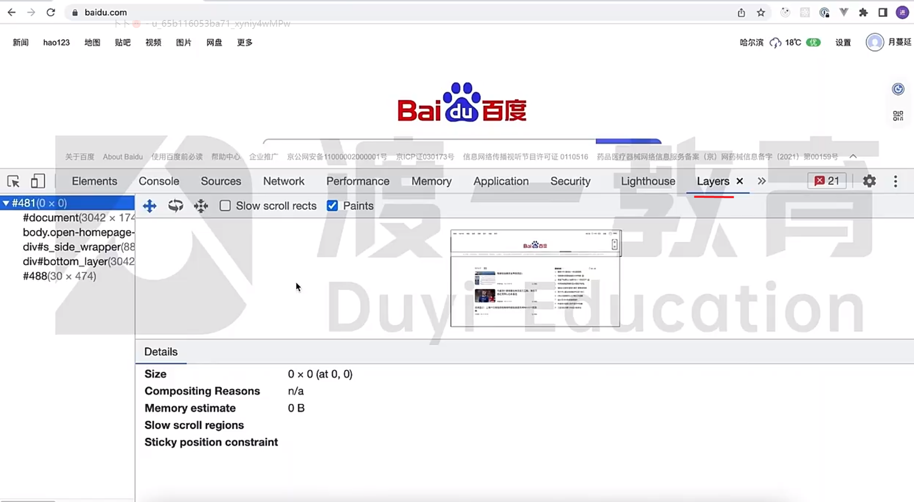
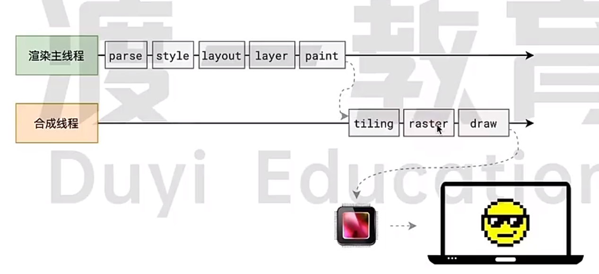

## 浏览器渲染原理
### 浏览器是如何渲染页面的？
当浏览器的网络线程收到 HTML 文件后，会产生一个渲染任务，并将其传递给渲染主线程的消息队列。
在事件循环机制的作用下，渲染主线程会从消息队列中取出渲染任务，并对其进行解析和构建 DOM 树、CSSOM 树等。
整个渲染流程分为多个阶段，分别是：HTML 解析、样式计算、布局、绘制(paint)、分块(Tiling)、光棚化(Raster 会用到GPU加速)、画(Draw)。
每个阶段都有明确的输入输出。上一个阶段的输出会成为下一个阶段的输入。

扩展：浏览器默认样式在 Styles 中的 user agent stylesheet。

下面是样式CSS Object Model (CSSOM)

给 <style>或<link> 加样式可以通过如下方式：
document.styleSheets[0].addRule('a', 'color: red;');

### 浏览器如何解析 HTML 文件？
浏览器会创建一个 DOM 树，其中包括 HTML 文件中的所有标签、属性和文本内容。
浏览器会解析 HTML 文件，将标签、属性和文本内容转换为 DOM 节点，并按照它们在 HTML 文件中的顺序添加到 DOM 树中。
浏览器会解析 CSS 文件，将样式规则应用到 DOM 节点上，生成一个 CSSOM 树。
浏览器会根据 CSSOM 树和 DOM 树，计算出每个节点在屏幕上的精确位置和大小，并将它们绘制出来。

为了提高解析效率，浏览器会启动一个与解析器率先下载和解析CSS, 如果主线程解析到的link位置，外部的CSS文件还没有下载解析好，主线程不会等待继续解析后续的HTML。这是因为下载和解析 CSS 的工作是在与解析线程中进行的，这就是 CSS 不会杜塞 HTML 解析的根本原因。

为什么 js 不可以像 CSS 那样异步下载？因为 JS 可能会修改 DOM 结构，如果在下载 JS 文件时修改了 DOM 结构，可能会导致 DOM 结构不一致。
### 浏览器如何解析 JS ？
渲染主线程遇到 JS 时必须暂停一切行为，等待下载执行完后才能继续渲染。
预解析线程可以分担一点下载 JS 的工作，但是不能完全解决 JS 阻塞渲染的问题。

扩展：浏览器的图层（Layers）
有堆叠上下文有关的属性就有可能影响分层。（如：z-index、opacity、transform等）
想要设置某个标签成为单独的图层
- 设置position为absolute或fixed
- 设置transform属性 will-change为transform
  等...
分成的好处在于，将来某一个层改变后，仅会对该层进行后续处理，从而提升效率。

完整过程

### 什么是 reflow?
当渲染树中的一部分(或全部)因为元素的规模尺寸，布局，隐藏等改变而需要重新构建。这就称为回流(reflow)。
### 什么是 repaint?
当渲染树中的一些元素需要更新属性，而这些属性只是影响元素的外观，风格，而不会影响布局的，比如 background-color。则就叫称为重绘。
### 为什么 reflow 比 repaint 更花费性能？
因为 reflow 需要重新计算元素的位置和几何信息，而 repaint 只需要重新绘制元素的样式。
### 为什么 transform 会提高效率？
因为 transform 不会影响布局，所以不会导致 reflow。