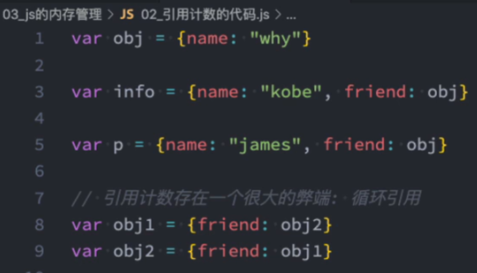

## 遇到函数如何执行
在执行过程中执行到一个函数时，就会根据函数体创建一个函数执行上下文（Functional Execution Context，简称FEC），并且压入到EC Stack中。EC Stack是一个LIFO的数据结构，即最后 pushed进去的上下文，最早会被pop出来。

FEC 中包含三部分内容：
1. 第一部分：在解析函数称为AST（Abstract Syntax Tree）语法树时，会创建一个Activation Object(简称AO)，包含了函数的所有局部变量、命名参数、自由变量以及this等。
2. 第二部分：作用域链：由 VO(在函数中就是AO对象)和父级VO组成，查找时会一层层查找
3. 第三部分：this 绑定的值
 

  FEC 被放入到 ECS 中

  

  FEC 开始执行代码
  

  执行过程：
    首先 全局执行上下文 会被放入到 执行上下文栈 中,

    而执行前 全局上下文 中的VO对象就指向GO对象

    然后 开始执行代码 。

    当执行到函数时，会创建一个 函数执行上下文 ，函数执行上下文 会入栈，这个函数执行上下文跟全局执行上下文类似，也有VO，不同的是这里的VO指向AO(Activation Object)对象。

    AO对象里面放着函数中的定义的参数、变量等。 当这个函数执行完毕时，这个函数上下文会出栈、销毁。AO对象也会被回收。

    当函数再次执行时，重复上述过程：

    创建函数上下文->入栈->执行函数代码->出栈->销毁。

    不管是AO对象中还是GO对象中，在代码没有执行到变量之前，变量都是没有被赋值的。可以把AO理解为一个小的函数作用域，而GO是一个大的全局作用域。作用域中代码的执行机制是一样的。

    我们知道函数内部可以使用函数外部的变量，这是因为作用域链的存在。

    当我们使用某一个变量时，会在自身作用域里查找，若没有就向上一级查找，直到查找到全局作用域。

    注：函数的父级作用域确定阶段是预编译阶段，跟函数位置有关，跟调用关系无关。

  回顾：
  在Parse阶段会生成一个全局对象 Global Object(GO)，这个对象里面放着公共类，以及代码中定义的全局变量，函数等，还有window对象也就是go自己。（GO对象包含window对象，GO对象又指向window对象）

  调用栈：js引擎内部有一个执行上下文栈（Execution Context Stack，简称ECS），它是用于执行代码的调用栈。 
  堆内存：对应的有一个堆内存（Heap），堆内存用于存储对象和数组。
  
  ## 变量环境和记录
  

  变量对象 VO 已经编程了 变量环境 VE

  变量环境 VE 又包含了 词法环境 LEX

  ## 面试题
  

 b没有定义var  就会被保存到全局

## 认识内存管理
不管什么样的编程语言，在代码执行过程中都是需要给他分配内存的，不同的是某些编程语言需要我们自己手动的管理内存，某些编程语言会可以自动帮助我们管理内存。       
不管以什么样的方式来管理内存，内存的管理都会有如下的声明周期：
    1. 分配申请你需要的内存（申请）
    2. 使用分配的内存（存放一些东西，比如对象等）
    3. 不需要使用时，对其进行释放

JavaScript 通常情况下是不需要手动来管理的

JavaScript 会在定义变量时为我们分配内存。

## JS 的垃圾回收
因为内存的大小是有限的，所以当内存不做需要的时候，我们需要对其进行释放，以便腾出更多的内存空间。
大部分现代的编程语言都是由自己的垃圾回收机制的：
1. 垃圾回收的英文 Garbage Collection,简称 GC
2. 对于不再使用的对象，我们称之为是垃圾，需要被回收，以便释放更多内存空间
3. 而我们的语言运行环境，比如java的运行环境 JVM，JavaScript的运行环境js引擎都会内存 垃圾回收器
4. 垃圾回收器 我们也会简称GC,其实是指垃圾回收器

## 常见的GC 算法--引用计算
当一个对象有一个引用指向它时，那么这个对象的引用就+1，当一个对象的引用为0时，这个对象就可以被销毁掉；
算法：当我们的 reation count == 0时候 GC会在下次回收时回收掉

这个算法有一个很大的弊端就是会产生循环引用

## 常见的GC 算法-标记清除
这个算法是设置一个根对象（root object），垃圾回收器会定期从根开始，找所有从根开始引用的对象，然后把所有能从根找到的对象，还有所有被这些对象找到的对象，然后把所有这些对象标记为存活的对象，然后把所有没有被标记的对象销毁掉。

这个算法可以很好的解决循环引用的问题

JS引擎比较广泛的采用的就是标记清除算法，当然类似于V8 引擎为了进行更好的优化，它在算法的实现细节上也会结合一些其他的算法，例如：
### 常见的GC 算法-标记整理
这个算法和标记清除算法很相似，但是这个算法会在整理存活对象的同时，也会整理内存空间。

### 常见的GC 算法-分代回收
分代回收算法是针对不同的对象，采用不同的算法来进行垃圾回收的。

