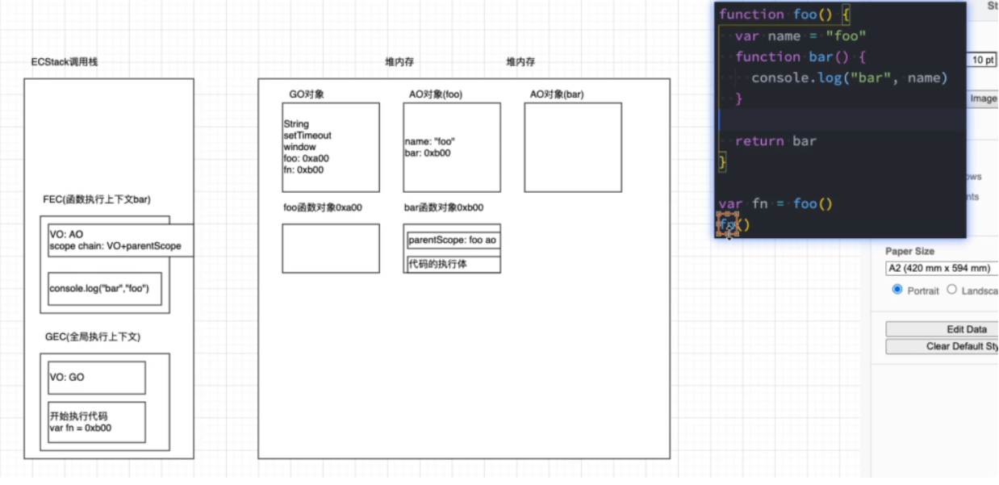
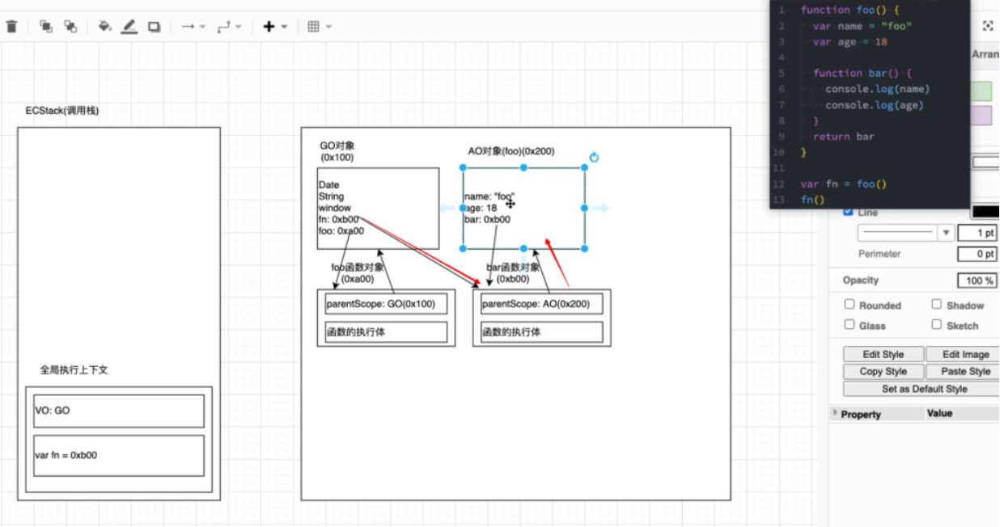
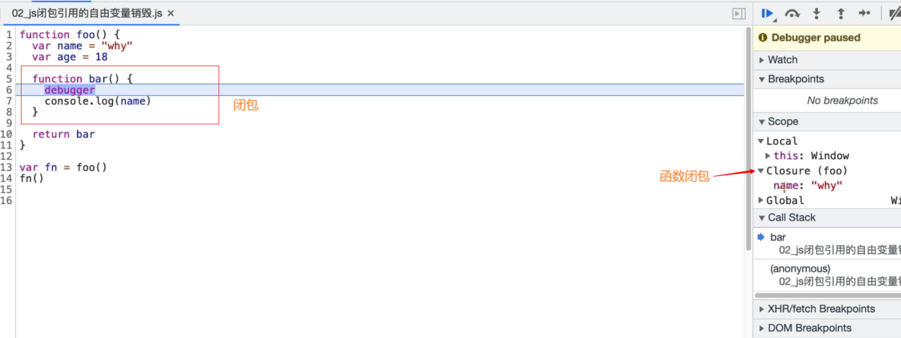
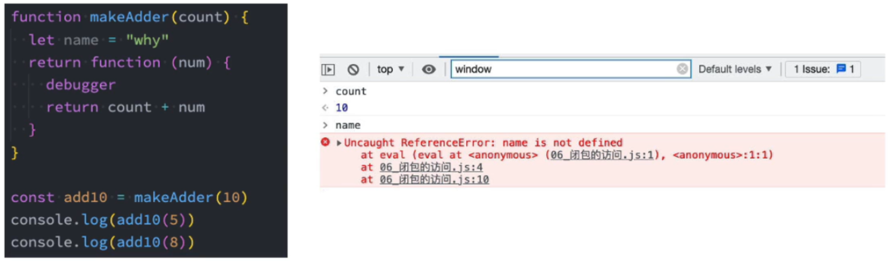

## 一等公民
js 中函数是一等公民，可以用于参数也可以用于返回值，相当灵活。

### 函数作为参数
```js
function forEach(arr, callback) {
    for (let i = 0; i < arr.length; i++) {
        callback(arr[i]);
    }
}

let arr = [1, 2, 3, 4, 5];
forEach(arr, function(item) {
    console.log(item);
});
```

### 函数作为返回值
```js
function create() {
    let data = [];

    return function(item) {
        data.push(item);
        console.log(data);
    }
}

let fn = create();
fn(1);
fn(2);
fn(3);
```

vue3 中使用的是 compostion api;早期是 setup函数 -> 代码(函数hook,定义函数)
react  早期是使用 class -> function (hooks函数)

从两个框架的发展来看  也是越来越重视 函数式 编程

## 高阶函数
把一个函数如果接收另一个函数作为参数，或者返回一个函数作为结果的函数，叫做高阶函数。

### 函数和方法的区别
- 函数是 function 关键字创建的，独立的使用function 称之为一个函数
- 方法是挂载在对象上的，通过对象调用方法

### 数组的方法
- forEach 是遍历
  例子：
  ```js
  let arr = [1, 2, 3, 4, 5];
  arr.forEach(function(item) {
      console.log(item);
  });
  ```
- map 是映射
  例子：
  ```js
  let arr = [1, 2, 3, 4, 5];
  let result = arr.map(function(item) {
      return item * 2;
  });
  console.log(result);
  ```
  forEach 和 map 的区别是
  - forEach 没有返回值，map 有返回值
  - forEach 无法 break，map 可以 break
  
- every 是判断
  例子：
  ```js
  let arr = [1, 2, 3, 4, 5];
  let result = arr.every(function(item) {
      return item > 2;
  });
  console.log(result);
  ```
- some 是判断
  例子：
  ```js
  let arr = [1, 2, 3, 4, 5];
  let result = arr.some(function(item) {
      return item > 2;
  });
  console.log(result);
  ```
  every 和 some 区别是
  every 判断数组中每一项是否都符合条件，如果都符合条件，则返回 true，如果有一项不符合条件，则返回 false。
  some 判断数组中是否存在符合条件的一项，如果存在，则返回 true，如果都不符合条件，则返回 false。

- find 是查找
  例子：
  ```js
  let arr = [1, 2, 3, 4, 5];
  let result = arr.find(function(item) {
      return item > 3;
  });
  console.log(result);
  ```
- findIndex 是查找
  例子：
  ```js
  let arr = [1, 2, 3, 4, 5];
  let result = arr.findIndex(function(item) {
      return item > 3;
  });
  console.log(result);
  ```
  find 和 findIndex 区别是
  find 查找符合条件的第一个元素，并返回该元素。
  findIndex 查找符合条件的第一个元素的索引，并返回该索引。
- filter 是筛选
  例子：
  ```js
  let arr = [1, 2, 3, 4, 5];
  let result = arr.filter(function(item) {
      return item > 3;
  });
  console.log(result);
  ```
- reduce 是汇总
  例子：
  ```js
  let arr = [1, 2, 3, 4, 5];
  let result = arr.reduce(function(preValue, item) {
      return preValue + item;
  });
  console.log(result);
  ```
- reduceRight 是汇总
  例子：
  ```js
  let arr = [1, 2, 3, 4, 5];
  let result = arr.reduceRight(function(preValue, item) {
      return preValue + item;
  });
  console.log(result);
  ```
  reduce 和 reduceRight 区别是
  reduce 从左到右依次处理数组中的元素。
  reduceRight 从右到左依次处理数组中的元素。

## 闭包的定义
  一个普通的函数function,如果它可以访问外层作用域的变量，那么它就是一个闭包。
  闭包是指有权访问另一个函数作用域中变量的函数。
  示例：
  

  foo 的AO 对象执行完，是不会被销毁的，因为bar的上层作用域指向 foo， GC 从根级开始查找回收没有用的内存，bar还是引用指向foo ，导致 foo是不会被销毁的，所以闭包有内存泄漏的问题，我们可以 当使用完fn（）后不再使用了 可以通过 fn=null 释放内存 
  

  例：闭包引用的自由变量
  

 我们来研究一个问题：AO对象不会被销毁时，释放里面所有属性都不会被释放？
- 下面这段代码中的name 属于闭包的父作用域里的变量
- 我们知道形成闭包之后 count 一定不会被销毁，那么 name 是否会被销毁掉尼？
- 我们打上断点，可以在浏览器上看到 name 被销毁了
  
 