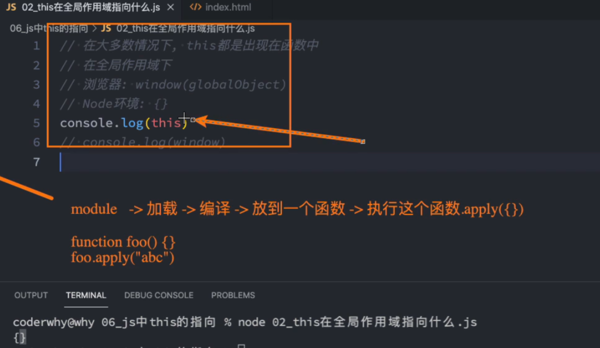

## this 指向是什么
在常见的编程语言中，几乎都有this 这个关键字（Objective-C 中使用的是self），但是在JavaScript中的this 不太一样。
- 常见的面向对象的编程语言中，比如Java、C++、Swift、Dart 等等一系列语言中，this 通常指挥出现在类的方法中。
- 但是在JavaScript中，this 更加灵活，无论是它出现的位置还是它代表的含义。
- 它没有固定的指向，this 的指向是动态的，是由函数的调用方式决定的。

我们先来看一下有 this 和没this 的区别：

### this 指向什么尼？
- 首先，this 指向调用它的对象
- 在全局作用域下，this 指向window(浏览器) 注：在Node环境下，this 指向global打印出的是{}

- 在类中，this 指向类的实例
- 箭头函数中的this 指向定义箭头函数时所在的作用域
- 构造函数中的this 指向构造函数的实例
  
开发中很少直接在全局作用域下使用this，所以大部分情况下，我们都是在对象的方法中或者函数中使用this。
- 所有的函数在被调用时，都会创建一个执行上下文（execution context）
- 这个执行上下文中包含两个重要的属性：
  - 变量对象（variable object）
  - 作用域链（scope chain）
- 其中，变量对象包含了函数的形参、函数声明、变量声明等。
- 作用域链包含了变量对象的引用，以及父级作用域的引用。
- 函数在执行时，会创建一个称为活动对象（activation object）的执行上下文，这个执行上下文会包含变量对象、作用域链、this等。
- 函数执行完毕后，这个执行上下文会被销毁，但是活动对象会一直保存在内存中，直到函数执行完毕。
- 因此，在函数执行期间，this 的指向会根据函数的调用方式而动态改变。
- 这就是为什么在JavaScript中，this 的指向是不确定的原因。
  
注：this 指向根我们的调用犯法和调用位置有关，和定义位置无关，不是在编译阶段绑定的，而是在执行阶段绑定的。
  
## this 的指向可以总结为以下四个规则：
### 规则一 ： 默认绑定
什么情况下使用默认绑定尼？独立函数调用
- 独立函数调用我们就可以理解成函数没有绑定到某个对象上进行调用
- 函数被独立调用的时候 this 指向window
  

### 规则二 ： 隐式绑定
另外一种比较常见的调用方式是通过某个对象进行调用的
- 也就是它的调用位置中，是通过某个对象发起的函数调用
- 通过某个对象发起的函数调用，会隐式绑定this指向某个对象，obj.foo()隐式把obj绑定给函数foo
  

### 规则三 ： 显示绑定
隐式绑定有一个前提条件，那就是它必须是一个对象，如果没有这样的引用，那么this会直接指向全局对象或者undefined。
如果我们不希望在对象内部调用函数，而是想直接在函数上进行调用，就可以使用call、apply、bind方法。
- call和apply 区别
  - call和apply的作用完全一样，只是接受参数的方式不太一样
  - call的第一个参数是this要指向的对象，后面是一个一个参数
  - apply的第一个参数是this要指向的对象，后面是一个数组
- 其中call和apply会立即执行函数，而bind方法会返回一个改变了this指向的函数

上面的绑定过程，我们明确的绑定了this指向，所以称之为显示绑定。

### 规则四 ： new 绑定
new 绑定是JavaScript中最强大的绑定方式，使用new来调用函数，会自动执行下面的操作：
- 创建一个全新的对象
- 这个新对象会被执行[[原型]]连接
- 这个新对象会绑定到函数调用的this上（this的绑定在这个步骤完成）
- 如果函数没有返回自定义对象，那么new表达式中的函数调用会自动返回这个新对象

### 内置函数的绑定
- JavaScript内置了一些函数，比如Math、Array等，这些函数的this指向的是全局对象
  - 数组的方法第二个参数是绑定this,如果没有绑定 默认this指向是window,除了箭头函数，箭头函数this指向上层作用域
  ```
  var names = ['a', 'b', 'c'];
  names.forEach(function(item) {
    console.log(item,this);
  },'abc');
  names.forEach(function(item) {
    console.log(item,this);
  },'bca');
  ```
- 还有DOM和BOM的原生方法，比如DOM的document.getElementById()等，这些方法的this指向的是DOM对象
- setTimeout和setInterval中的函数的this指向的是window（不用箭头函数的情况下）


### 优先级
new绑定 > 显示绑定 > 隐式绑定 > 默认绑定

call、apply的显示绑定高于隐式绑定
```
function foo() {
  console.log(this.a);
}

var obj1 = {
  a: 2 
};

var obj2 = { 
  a: 3,
  foo: foo
};

obj2.foo.call(obj1); // 2
```

bind的显示绑定高于隐式绑定
```
function foo() {
  console.log(this.a);
}

var obj1 = {
  a: 2 
};

var obj2 = { 
  a: 3,
  foo: foo
};

var bar = foo.bind(obj1);
bar.call(obj2); // 2
```

new 绑定高于隐式绑定
```
var obj={
  name:'张三',
  foo:function(){
    console.log(this);
  }
}
var bar=new obj.foo();// {} new出来的新对象
```

new 绑定高于显示绑定
```
function foo() {
  console.log(this);
}

var bar = foo.bind({ a: 3 });

var obj=new bar(); // {} new出来的新对象
```

特殊场景
- 当 call、apply、bind 绑定的是null和undefined的时候，这两个值在调用的时候会被忽略，实际应用的是默认绑定规则(this绑定成window)
- 间接函数引用
```
var obj1={
  name:'obj1',
  foo:function(){
    console.log(this);
  }
}
var obj2={
  name:'obj2'
}

(obj2.bar = obj1.foo)(); // window
```

