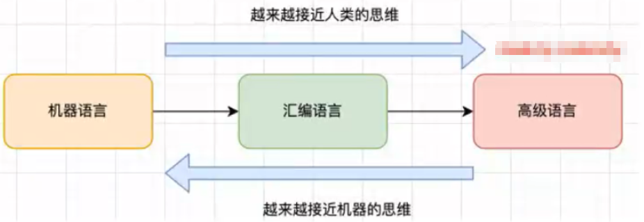
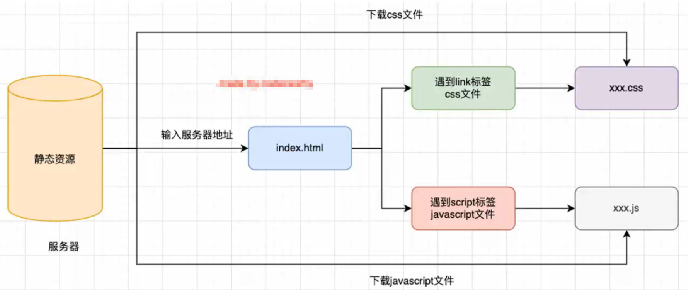
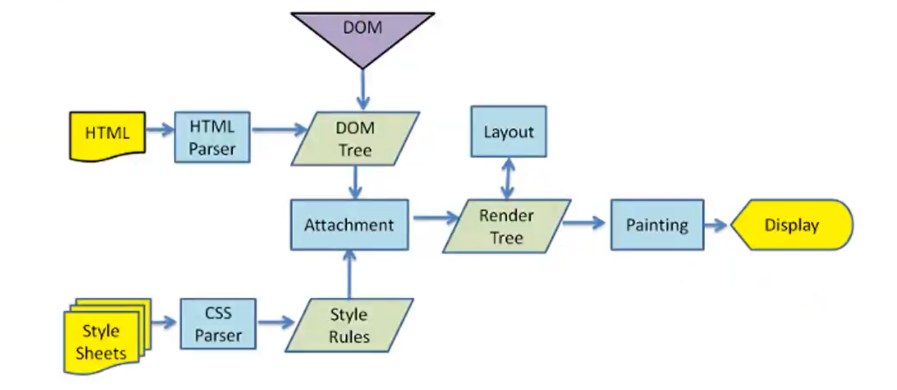
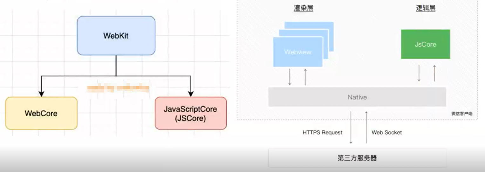
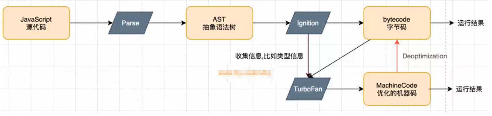
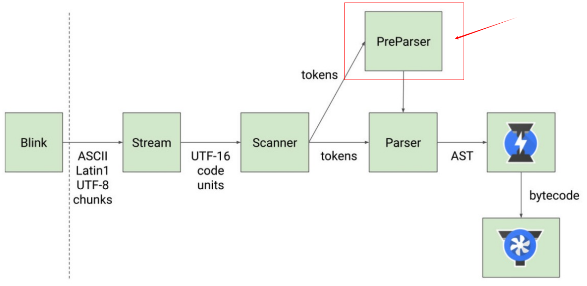
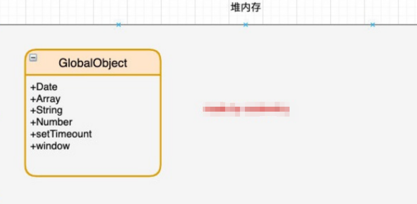
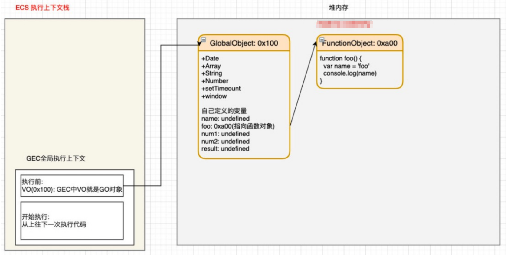
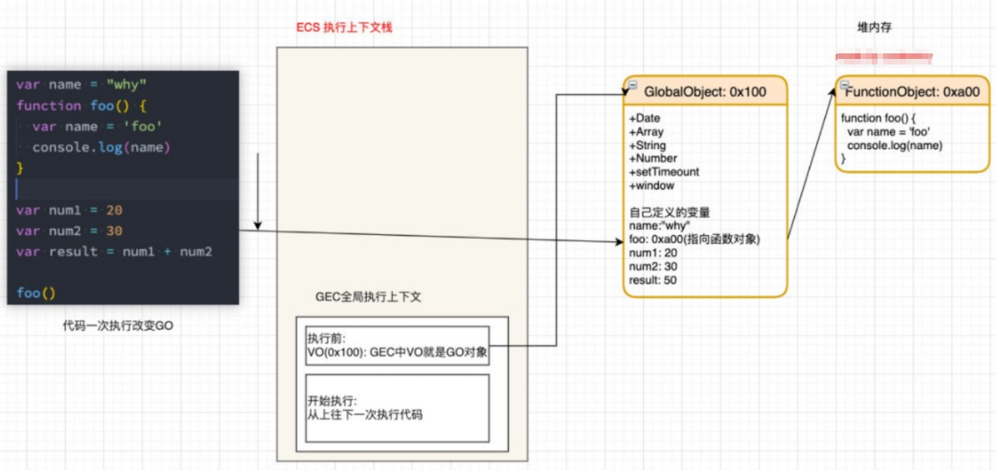

## JavaScript 是一门编程语言
JavaScript 是一门跨平台、面向对象的轻量级编程语言。它被世界上的绝大多数网站所使用，也被世界主流浏览器（IE、Firefox、Chrome、Safari、Opera等）支持。它是一种脚本语言，可以用来控制网页的行为，实现网页特效，与服务器进行交互，以及编写桌面应用程序。

JavaScript 是一门高级的编程语言，那么有高级编程语言，就有低级编程语言。低级编程语言通常被称为汇编语言。

从编程语言发展历史来说，可以划分为三个阶段：
1. 机器语言阶段:1000100111011000,一些机器指令；
2. 汇编语言阶段:BASIC,Cobol,Fortran,Pascal等；
3. 高级语言阶段:JavaScript,Python,Ruby,PHP等。

## 浏览器工作原理
输入一个网址之后浏览器做了什么？
1. 浏览器会开启一个线程来处理这个请求，会从浏览器缓存中查找当前网址对应的请求结果；
2. 如果浏览器缓存中存在当前网址对应的请求结果则直接返回；
3. 如果浏览器缓存中不存在当前网址对应的请求结果，则向服务器发起请求；
4. 服务器收到请求后，会根据请求的URL在自身存储的数据中查找对应的数据并返回给浏览器；
5. 浏览器收到返回的数据后，会根据HTML的格式将数据构建成DOM，并根据CSS的格式将数据构建成CSSOM，最后将DOM和CSSOM整合成渲染树(Render Tree)，然后浏览器开始渲染页面的内容。

比如：www.baidu.com > dns(域名解析)>找到ip服务器地址（服务器地址）>解析返回一个html>解析html 遇到css/js文件 下载到浏览器中

## 浏览器内核
不同的浏览器有不同的浏览器内核，
Blink内核 是Google开发的，目前用于Google Chrome、Edge、Opera等
浏览器的内核实际上指的是浏览器的排版引擎，不同的浏览器取名不同，有浏览器引擎、
页面渲染引擎等等

浏览器内核又可以分成两部分：渲染引擎(layout engineer或Rendering Engine)和JS引擎。

## 浏览器渲染过程

HTML Parser 是将HTML解析成DOM Tree的解析器

CSS Parser 是将CSS文件解析成CSSOM（CSS Object Model）

过程：
拿到HTML 浏览器内核的 HTML Parser 会将html解析成Dom tree ,
以及拿到 Style Sheets 浏览器会进行 CSS Parser将css解析成的 Style rules(css规则) > Attachment(附加)结合在一起>生成Render tree渲染树 >painting(绘制)>Display展示

Layout布局引擎（不同的浏览器分辨率等不同）>生成最终的Render tree渲染树
DOM节点通过js可以对Dom进行操作

## 认识 JavaScript 引擎
浏览器内核和JS引擎的关系？
我们先以 WebKit 为例，WebKit 内核包含两部分：
1. WebCore 是渲染引擎，负责页面渲染和布局，
2. JavaScriptCore 是 JS 引擎，负责解析和执行 JavaScript

JS引擎是浏览器内核的一部分，负责解析和执行JavaScript代码。

JavaScript 引擎可以被描述为“读取、执行 JavaScript 代码的程序”。

## V8引擎的原理
V8引擎是Google开发的开源JavaScript引擎，它被用于Chrome和Node.js等浏览器和运行时环境中。
v8引擎可以独立运行，也可以嵌入到其他应用程序中。如：C++ 等

v8引擎负责解析 JavaScript 代码，并将其转换为抽象语法树（AST）。然后，它会对 AST 进行优化，并生成机器代码。最后，它将机器代码转换为汇编语言，并最终执行该代码。

流程如：
js>Parse(解析成 词法分析--切割token 和 语法分析)>AST(抽象语法树)>lgnition(解释器/转化器)>生成bytecode字节码（不直接转成机器代码是因为可能JS跑的环境不同所以产生的机器代码也不同，如可能跑在Mac浏览器，window浏览器或Linux）>机器代码(汇编码)>CPU运行结果

扩展：
TurboFan 收集热函数，优化的机器指令>CPU运行 ，如果：类型没有统一v8就不好做热函数，所以ts相比普通函数运行性能相对高一点，因为ts类型统一了，v8可以收集到热函数，优化机器指令，所以ts运行性能高一点。

官方图解：

PreParser预解析，一开始不会执行的代码会预解析

## 初始化全局对象
js 引擎在执行代码之前，会在堆内存中创建一个全局对象:Global Object(GO)，这个全局对象包含了全局变量和函数。

## 执行上下文栈（调用栈）
js 引擎内部有一个执行上下文栈（Execution context stack，简称ECS），用来存储在代码执行期间创建的所有执行上下文。
那么他要执行谁尼？执行的是全局代码块：
1. 全局的代码块为了执行会构建一个 Global Execution Context 简称GEC（全局执行上下文）
2. GEC 会被放入到 ECS 栈中，ECS 栈中默认有一个全局执行上下文，全局执行上下文是 js 引擎执行代码的起点。
3. 全局执行上下文被激活，开始执行代码，当全局执行上下文执行完毕，会被销毁，然后 ECS 栈会弹出该全局执行上下文。

GEC 被放入到 ECS 栈中里面包含两部分内容：
1. 第一部分：在代码执行前，在parser转成 AST 的过程中，会将全局定义的变量和函数等加入到 GlobalObject 中，但是并不会赋值。
 
3. 第二部分：在代码执行过程中，对变量赋值，或者执行其他的函数
 
